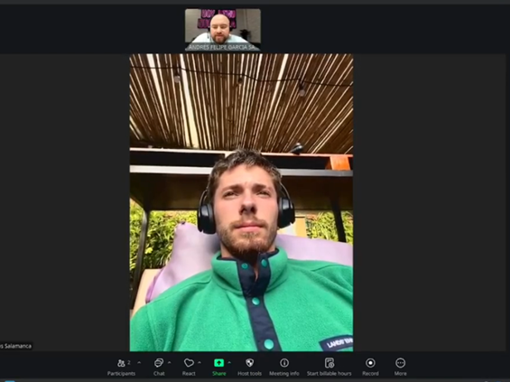

<!-- 
    CARATULA
-->

<p align="center">  </p><div align="center"> 

<strong><h4>Universidad Peruana de Ciencias Aplicadas</h4></strong> </div>
<div align="center"> <strong>Ingeniería de Software</strong> </div>
<br>
<div align="center"> <strong>SEXTO CICLO</strong> </div>

<div align="center"> Aplicaciones Para Dispositivos Móviles – CC238 </div><div align="center"> 12614 </div>

<br>
<div align="center"> <strong>Docente:</strong> Quevedo Velasco, David Gerardo </div>
<br>

<div align="center"> <strong>INFORME TB1</strong> </div>
<br>
<div align="center"> <strong>ThinkUp</strong> </div><div align="center"> <strong>SkillShare</strong> </div>

<br>
<div align="center"> Argomedo Camacho, Jhosep Jamil (U20231D978) </div>
<div align="center"> García Salamanca, Andrés Felipe (U202523463) </div>
<div align="center"> González Custodio, Carlos Alberto (U202020230) </div>
<div align="center"> Julca Cruz, Renso Anthony (U202121579) </div>
<div align="center"> Ramírez Tello, Sebastian (U202316122) </div>

<br>
<br>
<div align="center"> <strong>Septiembre, 2025</strong> </div>

<br>
<br>
<br>
<br>
<br>
<br>

<!-- 
    REGISTRO DE VERSIONES DEL INFORME 
-->

# Registro de versiones del Informe

| **Versión** | **Fecha**   | **Autor**  | **Descripción de modificación**    |
|-------------|-------------|---------------------------------------------------------------------------|--------------------------------------------------------------------------------------------------|
| TB1         | 1809/25     | Argomedo, Jhosep; <br> García, Andrés; <br> González, Carlos; <br> Julca, Renso; <br> Ramírez, Sebastian. | Adición de secciones: <br> **Capítulo I:** Presentación <br> **Capítulo II:** Requirements Development and Software Solution Design |

<br>
<br>
<br>
<br>
<br>
<br>

<!-- 
    PROJECT REPORT COLLABORATION INSIGTHS
-->

# Project Report Collaboration Insights

## Repositorio de Informe del Proyecto:
El informe del proyecto se ha desarrollado de manera colaborativa en el repositorio de GitHub. Cada miembro del equipo fue responsable de diferentes secciones del informe, y se utilizó el control de versiones para realizar commits y revisiones de manera constante.

- ***Distribución de Tareas:***
El equipo dividió el informe en secciones específicas, asignando responsabilidades a cada miembro. Las tareas se distribuyeron según las fortalezas de cada uno.

- ***Colaboración Continua:***
Cada miembro realizó commits y revisiones mediante pull requests, asegurando la integración de las aportaciones de todos. La redacción se revisó y mejoró iterativamente a lo largo del proyecto.

- ***Finalización del Informe:***
Una vez completadas todas las secciones, el informe se revisó en conjunto antes de realizar el commit final con la versión de entrega.

## Evidencias de la Colaboración
A continuación, se muestran evidencias gráficas que ilustran la participación de cada miembro:

### Captura de Commits:

<br>
<br>


<br>
<br>
<br>
<br>
<br>
<br>
<!-- 
    CONTENIDO
-->

# Contenido

- [Registro de versiones del Informe](#registro-de-versiones-del-informe)
- [Project Report Collaboration Insights](#project-report-collaboration-insights)
- [Contenido](#contenido)
- [Student Outcome](#student-outcome)

## [Capítulo 1: Presentación](#capítulo-i-presentación)
- [1.1. Startup Profile](#11-startup-profile)
  - [1.1.1. Descripción de la Startup](#111-descripción-de-la-startup)
  - [1.1.2. Perfiles de integrantes del equipo](#112-perfiles-de-integrantes-del-equipo)
- [1.2. Solution Profile](#12-solution-profile)
  - [1.2.1. Antecedentes y problemática](#121-antecedentes-y-problemática)
  - [1.2.2. Lean UX Process](#122-lean-ux-process)
    - [1.2.2.1. Lean UX Problem Statements](#1221-lean-ux-problem-statements)
    - [1.2.2.2. Lean UX Assumptions](#1222-lean-ux-assumptions)
    - [1.2.2.3. Lean UX Hypothesis Statements](#1223-lean-ux-hypothesis-statements)
    - [1.2.2.4. Lean UX Canvas](#1224-lean-ux-canvas)
- [1.3. Segmentos objetivo](#13-segmentos-objetivo)

## [Capítulo 2: Requirements Elicitation & Analysis](#capítulo-ii-requirements-elicitation--analysis)
- [2.1. Competidores](#21-competidores)
  - [2.1.1. Análisis competitivo](#211-análisis-competitivo)
  - [2.1.2. Estrategias y tácticas frente a competidores](#212-estrategias-y-tácticas-frente-a-competidores)
- [2.2. Entrevistas](#22-entrevistas)
  - [2.2.1. Diseño de entrevistas](#221-diseño-de-entrevistas)
  - [2.2.2. Registro de entrevistas](#222-registro-de-entrevistas)
  - [2.2.3. Análisis de entrevistas](#223-análisis-de-entrevistas)
- [2.3. Needfinding](#23-needfinding)
  - [2.3.1. User Personas](#231-user-personas)
  - [2.3.2. User Task Matrix](#232-user-task-matrix)
  - [2.3.3. User Journey Mapping](#233-user-journey-mapping)
  - [2.3.4. Empathy Mapping](#234-empathy-mapping)
  - [2.3.5. Ubiquitous Language](#235-ubiquitous-language)

## [Capítulo 3: Requirements Specification](#capítulo-iii-requirements-specification)
- [3.1. User Stories](#31-user-stories)
- [3.2. Technical Stories](#32-technical-stories)
- [3.3. Impact Mapping](#33-impact-mapping)
- [3.4. Product Backlog](#34-product-backlog)

## [Capítulo 4: Solution Software Design](#capítulo-iv-solution-software-design)
- [4.1. Strategic-Level Domain-Driven Design](#41-strategic-level-domain-driven-design)
  - [4.1.1. EventStorming](#411-eventstorming)
    - [4.1.1.1. Candidate Context Discovery](#4111-candidate-context-discovery)
    - [4.1.1.2. Domain Message Flows Modeling](#4112-domain-message-flows-modeling)
    - [4.1.1.3. Bounded Context Canvases](#4113-bounded-context-canvases)
  - [4.1.2. Context Mapping](#412-context-mapping)
  - [4.1.3. Software Architecture](#413-software-architecture)
    - [4.1.3.1. Software Architecture Context Level Diagrams](#4131-software-architecture-context-level-diagrams)
    - [4.1.3.2. Software Architecture Container Level Diagrams](#4132-software-architecture-container-level-diagrams)
    - [4.1.3.3. Software Architecture Deployment Diagrams](#4133-software-architecture-deployment-diagrams)

- [4.2. Tactical-Level Domain-Driven Design](#42-tactical-level-domain-driven-design)
   - [4.2.1. Bounded Context:](#421-bounded-context)
      - [4.2.1.1. Domain Layer](#4211-domain-layer)
      - [4.2.1.2.Interface Layer](#4212-interface-layer)
      - [4.2.1.3. Application Layer](#4213-application-layer)
      - [4.2.1.4. Infrastructure Layer](#4214-infrastructure-layer)
      - [4.2.1.5. Bounded Context Software Architecture Component Level Diagrams](#4215-bounded-context-software-architecture-component-level-diagrams)
      - [4.2.1.6. Bounded Context Software Architecture Code Level Diagrams](#4216-bounded-context-software-architecture-code-level-diagrams)
         - [4.2.1.6.1. Bounded Context Domain Layer Class Diagrams](#42161-bounded-context-domain-layer-class-diagrams)
         - [4.2.1.6.2. Bounded Context Database Design Diagram](#42162-bounded-context-database-design-diagram)

---

- [Conclusiones](#conclusiones)
- [Bibliografía](#bibliografía)
- [Anexos](#anexos)

<br>
<br>
<br>
<br>
<br>
<br>
<!-- 
    STUDENT OUTCOME
-->

# Student Outcome

**ABET – EAC - Student Outcome 7**  
*Criterio: La capacidad de adquirir y aplicar nuevos conocimientos según sea necesario, utilizando estrategias de aprendizaje apropiadas.*

<br>

| **Criterio específico** | **Acciones realizadas** | **Conclusiones** |
|:------------------------|:------------------------|:-----------------|
| **Actualiza conceptos y conocimientos necesarios para su desarrollo profesional y en especial para su proyecto en soluciones de software.** | - **Argomedo Camacho, Jhosep Jamil (TB1):** <br> • Investigué y apliqué metodologías Lean UX Canvas.<br> • Desarrollé análisis competitivo con matrices de comparación.<br> • Creé user personas completas con journey maps y empathy mapping.<br><br>- **Ramirez Tello, Sebastian (TB1):** <br> • Apliqué técnicas de design thinking para discovery.<br> • Desarrollé entrevistas cualitativas y análisis de resultados.<br> • Implementé specification requirements con user stories.<br><br>- **Julca Cruz, Renso Anthony (TB1):** <br> • Realicé dos entrevistas: una a una estudiante universitaria y otra a una persona autodidacta, recopilando experiencias sobre métodos de aprendizaje, retos y estrategias.<br> • Apliqué actividades de Strategic-Level Domain-Driven Design (DDD): EventStorming, Candidate Context Discovery, Domain Message Flows Modeling, Bounded Context Canvases. <br><br>- **Gonzalez Custodio, Carlos Alberto (TB1)** <br> • Realice 2 entrevistas para el segmento Docente, para poder conocer más las necesidades de los usuarios. <br> • Presente los diagramas C4 que permite comprender de manera más clara como se organiza la solución.  Dichos diagramas son: Context Level Diagram, Container Level Diagram y Deployment Diagra| - **Argomedo Camacho, Jhosep Jamil (TB1):** Actualicé mis conocimientos en metodologías ágiles y de diseño, aplicando con éxito Lean UX y DDD al proyecto. Mi investigación en análisis competitivo permitió identificar ventajas diferenciales para la solución.<br><br>- **Ramirez Tello, Sebastian (TB1):** Actualicé mis conocimientos en técnicas de discovery y engineering de requisitos, aplicando metodologías de design thinking y especificación ágil para el proyecto.<br><br>- **Julca Cruz, Renso Anthony (TB1):** La aplicación de los conocimientos adquiridos en el curso, junto con la información de entrevistas, permitió actualizar y reforzar habilidades en el diseño de soluciones de software basadas en DDD. Esto evidencia la capacidad del grupo para adquirir nuevos conocimientos y adaptarlos al contexto del proyecto. <br><br>- **Gonzalez Custodio, Carlos Alberto (TB1):** Logré adquirir nuevas habilidades y conocimientos al comprender como elaborar Diagramas C4 ademas de poder entender las necesidades del usuario mediantes las entrevistas realizadas. |
| **Reconoce la necesidad del aprendizaje permanente para el desempeño profesional y el desarrollo de proyectos en soluciones de software.** | - **Argomedo Camacho, Jhosep Jamil (TB1):** <br> • Aprendí técnicas avanzadas de needfinding.<br> • Investigué arquitecturas software escalables.<br> • Apliqué strategic modeling techniques.<br> • Desarrollé habilidades en competitive analysis.<br><br>- **Ramirez Tello, Sebastian (TB1):** <br> • Investigué best practices para startup profiling.<br> • Aprendí técnicas de problem framing y solution positioning.<br> • Desarrollé habilidades en qualitative research. <br><br>- **Julca Cruz, Renso Anthony (TB1):** <br> • Durante el desarrollo de las actividades de EventStorming y modelado de flujos de mensajes de dominio, se identificó la importancia de comprender de manera continua los cambios en los requerimientos del negocio y en las prácticas modernas de desarrollo de software. <br> • En las entrevistas se resaltó la relevancia de la autoformación y la actualización constante como factores clave para el crecimiento profesional. <br><br>- **González Custodio, Carlos Alberto (TB1):** <br> • Aprendí Software Architecture y creacion de modelos C4 para un mayor comprensión y entendimiento de como esta organizado todo siguiendo las buenas practicas. | - **Argomedo Camacho, Jhosep Jamil (TB1):** Demostré comprensión de que el aprendizaje continuo es esencial, investigando constantemente nuevas metodologías para mejorar la calidad del proyecto y su desarrollo profesional.<br><br>- **Ramirez Tello, Sebastian (TB1):** Mostré reconocimiento de la necesidad de aprendizaje continuo, investigando constantemente nuevos approaches para validación de negocio y desarrollo de soluciones software efectivas. <br><br> - **Julca Cruz, Renso Anthony (TB1):** El grupo reconoce que el aprendizaje no concluye con el curso, sino que debe mantenerse activo en la investigación y práctica de nuevas metodologías de diseño y arquitectura. Esto refuerza la visión de aprendizaje permanente como parte esencial del desempeño profesional en ingeniería de software. <br><br>- **González Custodio, Carlos Alberto (TB1):** Logré adquirir nuevos conocimientos y experiencia que me servirán para futuros trabajos y además para la conclusión del presente proyecto. |

<br>
<br>
<br>
<br>
<br>
<br>
<!-- 
    CAPÍTULO 1 - PRESENTACIÓN
-->

# Capítulo I: Presentación

## 1.1. Startup Profile

### 1.1.1. Descripción de la Startup

Somos **ThinkUp**, una startup fundada por estudiantes apasionados por la innovación educativa y la tecnología, comprometidos en transformar la manera en que los jóvenes aprenden y colaboran.  

Creemos que el conocimiento crece cuando se comparte, y por ello hemos desarrollado **SkillShare**, una aplicación de red social enfocada en conectar estudiantes con intereses académicos similares para formar grupos de estudio dinámicos y efectivos.  

**SkillShare** permite a los estudiantes:  
- Crear y unirse a grupos según materias o temas específicos.  
- Acceder a chats y videollamadas integradas.  
- Compartir recursos como apuntes, notas, quizzes y materiales de estudio.  

Con esta herramienta buscamos reducir el aislamiento académico, facilitar la preparación para exámenes y promover un aprendizaje colaborativo más enriquecedor.  

---

### Misión, Visión y Valores

| **Elemento** | **Descripción** |
|--------------|-----------------|
| **Misión**   | Impulsar el aprendizaje colaborativo mediante la tecnología, brindando a los estudiantes una plataforma que conecte personas con los mismos objetivos académicos, fomente la cooperación y facilite el acceso a recursos de estudio compartidos para mejorar el rendimiento académico. |
| **Visión**   | Convertirnos en la **red social educativa líder en Latinoamérica y el mundo**, donde millones de estudiantes encuentren en SkillShare un espacio seguro, dinámico y confiable para aprender juntos, potenciar sus capacidades y construir comunidades académicas sólidas que trasciendan las aulas. |
| **Valores**  | - **Colaboración**: Creemos que el conocimiento se multiplica cuando se comparte y trabajamos para fortalecer la cooperación entre estudiantes.<br>- **Innovación**: Apostamos por el uso de la tecnología para transformar la manera en que las personas aprenden y se relacionan académicamente.<br>- **Accesibilidad**: Buscamos que todos los estudiantes, sin importar su lugar de origen o nivel socioeconómico, puedan acceder a herramientas de calidad para mejorar su aprendizaje.<br>- **Compromiso con la educación**: Nos motiva la mejora continua del proceso educativo, impulsando el desarrollo personal y colectivo. |

### 1.1.2. Perfiles de integrantes del equipo  

| **Integrante** | **Perfil** | **Foto** |
|----------------|------------|----------|
| **Jhosep J. Argomedo Camacho** <br><br> **Código:** U20231D978 <br><br> **Carrera:** Ingeniería de Software <br><br> **Rol:** Líder | Soy estudiante de Ingeniería de Software en la UPC (6to ciclo) con experiencia básica en desarrollo de aplicaciones móviles utilizando Flutter. Manejo herramientas como Git, GitHub y Figma, así como lenguajes de programación como HTML, CSS, Python, JavaScript, y bases de datos SQL y NoSQL. Con conocimientos en SCRUM y en la creación de User Stories, me destaco por mi liderazgo, responsabilidad y habilidad para coordinar equipos, enfocándome en el logro de objetivos comunes. |  |
| **Andrés Felipe García Salamanca** <br><br> **Código:** U202523463 <br><br> **Carrera:** Ingeniería de Software <br><br> **Rol:** Miembro | Soy estudiante de Ingeniería de Sistemas en la CUN (Colombia) y actualmente curso el 4to ciclo como parte de un programa de intercambio en la UPC. Mi formación se orienta al área de infraestructura tecnológica, con bases en redes y en la gestión de entornos digitales aplicados a la educación. Me interesa comprender cómo la tecnología puede mejorar los procesos de aprendizaje y fortalecer el trabajo colaborativo entre estudiantes. A través de este intercambio busco ampliar mi perspectiva académica, participar en proyectos que integren innovación y educación, y continuar desarrollando mis competencias profesionales en el ámbito de la ingeniería. |  |
| **Renso Anthony Julca Cruz** <br><br> **Código:** U202121579 <br><br> **Carrera:** Ingeniería de Software <br><br> **Rol:** Miembro | Estudiante de Ingeniería de Software, actualmente curso el 6to ciclo de esta carrera. Me apasiona programar y ser autodidacta para poder mejorar mis habilidades en el desarrollo de software, quisiera dedicarme a la parte de gestión bancaria. |  |
| **Carlos Alberto González Custodio** <br><br> **Código:** U202020230 <br><br> **Carrera:** Ingeniería de Software <br><br> **Rol:** Miembro | Soy estudiante de Ingeniería de Software, me encuentro actualmente cursando el 6to ciclo. Me encanta enriquecer mis conocimientos con nuevos desafíos y tengo un gran interés por el desarrollo web. |  |
| **Sebastian Ramirez Tello** <br><br> **Código:** U202316122 <br><br> **Carrera:** Ingeniería de Software <br><br> **Rol:** Miembro | Soy estudiante de 6to ciclo de la carrera de Ingeniería de Software. Me gusta mucho emplear soluciones creativas y que busquen eficiencia para poder abordar de esta forma cualquier desafío de la mejor manera.|  |

<br>
<br>

# 1.2. Solution Profile  

En esta sección, se presenta en detalle el perfil de la solución, respaldado por un sólido fundamento de antecedentes y desarrollado de manera metódica, siguiendo el proceso de Lean UX.  

---

## 1.2.1. Antecedentes y problemática  

El estudio colaborativo ha demostrado ser una estrategia pedagógica altamente eficaz para mejorar el rendimiento académico y la experiencia estudiantil. Según un metaanálisis de 39 estudios, los estudiantes que participan en grupos de estudio obtienen calificaciones significativamente mejores y desarrollan una comprensión más profunda del material en comparación con quienes estudian de forma individual (Johnson et al., 2022).  

Por ejemplo, una investigación realizada en la UCLA encontró que estudiantes que formaban parte de grupos de estudio tenían un 10% más de probabilidades de obtener una A o B en sus cursos (Smith & Lee, 2021). Asimismo, entornos de aprendizaje activo que incluyen actividades grupales han demostrado reducir las tasas de desaprobación en áreas STEM y elevar las calificaciones en aproximadamente seis puntos porcentuales (Martínez & Gómez, 2023).  

En el ámbito de la educación colaborativa, se ha observado que los estudiantes en equipos pequeños, ideales de tres a cuatro miembros, superan significativamente en rendimiento académico a quienes estudian solos. Además, estos entornos fomentan una mayor retención de información a través de discusiones, desarrollo de pensamiento crítico, motivación, asistencia y disfrute del aprendizaje (Kim et al., 2020).  

El mecanismo del *peer teaching*, donde un estudiante explica un concepto a sus pares, genera una retención y entendimiento más sólidos del contenido. Este fenómeno, conocido como *efecto del protegido* (*protégé effect*), ha sido cuantificado como un factor clave para reforzar la propia comprensión mediante la enseñanza (Fiorella & Mayer, 2019).  

Más allá del rendimiento académico, los grupos de estudio contribuyen a una experiencia educativa más satisfactoria y a una mayor permanencia estudiantil. Estudiantes involucrados en actividades extracurriculares, como sociedades estudiantiles o deportes, tienen hasta cinco veces más probabilidades de continuar sus estudios que aquellos que no participan (Johnson & Barker, 2024).  

Un sentido de pertenencia, que se fortalece en dinámicas colaborativas, se ha vinculado a una mayor motivación, mejor ajuste académico y emocional, y menores tasas de deserción (Thompson et al., 2021).  

No obstante, se identifican retos en la práctica del estudio colaborativo. Investigaciones recientes muestran que, aunque entre el 41% y el 78% de los estudiantes participan al menos alguna vez en grupos de estudio, un 55% nunca lo ha hecho, y alrededor del 22% abandona el grupo durante el semestre. Las dificultades para coordinar horarios, las distracciones, la participación desigual y las estructuras grupales poco efectivas son las principales razones detrás de estas problemáticas (García & Martínez, 2022).  

En contextos de enseñanza remota o híbrida, el componente tecnológico ha generado nuevas dinámicas. Algunos estudios indican que estudiantes que colaboran mediante foros o redes de apoyo académico, especialmente aquellos con rendimiento previo bajo, mejoran significativamente su GPA final (Brown et al., 2023).  

Sin embargo, en secundaria, el efecto positivo de la colaboración sólo se manifiesta después de un tiempo prolongado, principalmente cuando se establecen vínculos de confianza entre los estudiantes (Nguyen & Carroll, 2021).  

Finalmente, el rol que cada estudiante ocupa dentro de su red social académica influye en su rendimiento: quienes están en posiciones centrales, conectados con muchos pares, tienden a presentar mejor desempeño, mientras que los estudiantes aislados tienen peores resultados (López & Kim, 2024).  

---

## The 5W’s  

### 1. What? (¿Qué?)  
**¿Cuál es el problema?**  
Muchos estudiantes enfrentan dificultades para organizarse y encontrar compañeros de estudio con intereses y necesidades académicas similares. Esto genera preparación individual poco efectiva, desmotivación y, en algunos casos, mayor riesgo de bajo rendimiento académico o abandono. La falta de espacios digitales estructurados para formar grupos de estudio limita el potencial del aprendizaje colaborativo. 

**¿Cuál es la relación con la persona en cuestión?**  
Los estudiantes dependen de una preparación adecuada para aprobar sus cursos y mejorar su rendimiento académico. La aplicación SkillShare les ofrece un espacio accesible y seguro para crear grupos de estudio, conectarse con pares que comparten las mismas materias o intereses, y colaborar mediante chats, videollamadas y recursos compartidos. 

---

### 2. When? (¿Cuándo?)  
**¿Cuándo sucede el problema?**  
El problema ocurre durante el ciclo académico, especialmente en periodos de evaluaciones parciales y finales, cuando los estudiantes necesitan reforzar sus conocimientos y se ven limitados por la falta de espacios adecuados para estudiar en grupo. También se presenta al inicio de un curso, cuando los estudiantes aún no han formado redes de apoyo académico y se sienten aislados en su preparación. 

**¿Cuándo utiliza el cliente el producto?**  
Los estudiantes utilizan SkillShare en momentos clave del ciclo de aprendizaje:  
- Al organizar sesiones de estudio previas a exámenes.  
- Al buscar apoyo para entender un tema complejo.  
- Al compartir apuntes y recursos después de clases.  

Además, pueden recurrir a la aplicación como complemento a su rutina académica diaria y semanal.  

---

### 3. Where? (¿Dónde?)  
**¿Dónde está el cliente cuando usa el producto?**  
El cliente (estudiante) utiliza la aplicación desde su hogar, la universidad, bibliotecas, cafeterías o cualquier espacio donde estudie, ya que SkillShare es una aplicación accesible desde dispositivos móviles. 

**¿A dónde se dirige?**  
El estudiante se dirige hacia un entorno de estudio más organizado y colaborativo, donde puede conectarse con compañeros, compartir recursos y mejorar su preparación académica. 

**¿Dónde surge el problema?**  
El problema surge en contextos educativos donde los estudiantes carecen de redes de apoyo efectivas:  
- Aulas con grupos numerosos.  
- Ambientes de estudio poco flexibles.  
- Modalidades virtuales con poca interacción entre pares.  

---

### 4. Who? (¿Quién?)  
**¿Quiénes están involucrados?**  
Los principales involucrados son los estudiantes de educación superior, pero también participan docentes que promueven el aprendizaje colaborativo, instituciones educativas interesadas en mejorar el rendimiento de sus alumnos y desarrolladores de tecnología que diseñan la plataforma. 

**¿A quiénes les sucede el problema?**  
El problema afecta principalmente a estudiantes universitarios y escolares de niveles avanzados que necesitan reforzar sus conocimientos, pero que carecen de espacios o herramientas adecuadas para conectar con compañeros de estudio. 

**¿Quién lo utilizará?**  
La aplicación será utilizada por estudiantes de diferentes niveles y carreras que buscan formar grupos de estudio, compartir materiales y organizar sesiones colaborativas. A futuro, también puede ser usada por instituciones educativas como complemento a sus programas académicos. 

---

### 5. Why? (¿Por qué?)  
**¿Cuál es la causa del problema?**  
La causa principal radica en la falta de herramientas accesibles y estructuradas para organizar el estudio en grupo. Muchos estudiantes dependen de métodos informales (como chats dispersos en WhatsApp o reuniones improvisadas) que dificultan la coordinación, la constancia y el aprovechamiento del aprendizaje colaborativo. A ello se suma la falta de tiempo, diferencias en horarios y la ausencia de plataformas que integren comunicación, recursos y organización académica en un solo espacio. 

---

## The 2H’s  

### 1. How? (¿Cómo?)  
**¿En qué condiciones los clientes usan nuestro producto?**  
Los estudiantes utilizan SkillShare en contextos académicos que requieren organización y colaboración, como preparación para exámenes, desarrollo de proyectos grupales o repaso de contenidos complejos. Lo hacen desde sus dispositivos móviles, en casa, en la universidad, en la biblioteca o incluso de forma remota en entornos híbridos. 

**¿Cómo nos conocieron los compradores?**  
Los estudiantes conocen SkillShare principalmente a través de campañas en redes sociales, recomendaciones boca a boca entre compañeros, alianzas con instituciones educativas y presencia en ferias o eventos universitarios relacionados con tecnología y educación. 

**¿Cómo prefieren acceder al contenido?**  
Prefieren acceder al contenido de manera rápida y sencilla desde la aplicación móvil, con notificaciones en tiempo real sobre actividades del grupo, acceso directo a materiales compartidos y recordatorios de sesiones de estudio programadas. También valoran la disponibilidad multiplataforma para poder continuar su aprendizaje desde cualquier dispositivo. 

**¿Qué los llevó a esta situación?**  
La necesidad de optimizar el tiempo de estudio, mejorar su rendimiento académico y superar la dificultad de coordinar con sus pares a través de medios dispersos (grupos de WhatsApp, correos electrónicos, redes sociales no académicas) llevó a los estudiantes a buscar una herramienta centralizada y eficiente que fomente el aprendizaje colaborativo. 

### 2. How much? (¿Cuánto?)  
**¿Cuánto afecta este problema a los usuarios?**  

El aprendizaje activo —que incluye el trabajo en pequeños grupos— mejora significativamente los resultados académicos: los estudiantes tienen un 6 % más de puntaje en exámenes y son 1,5 veces menos propensos a reprobar en cursos de Ciencias, Tecnología, Ingeniería y Matemática (STEM) comparados con métodos tradicionales. 

Un meta-análisis mostró que el aprendizaje en pequeños grupos reduce la tasa de fracaso del 32 % al 21 %, y aumenta el rendimiento en evaluaciones en 0,47 desviaciones estándar, un efecto estadísticamente robusto. 

Otra revisión comprobó que el aprendizaje colaborativo (peer-led team learning, PLTL) conduce a un incremento promedio del 15 % más estudiantes que logran notas de ABC, en comparación con clases tradicionales. 

<br>
<div align="center">


*Comparison of failure rates and exam score improvements between traditional lecturing and active learning in STEM education*

</div>


**¿Cuánto cuesta realizar el proyecto?**  
El costo de desarrollar una plataforma como SkillShare, que incluye funciones como chat, videollamadas, grupos y recursos compartidos, varía según la complejidad y las funcionalidades requeridas. Según fuentes como Crowdbotics, el costo para un MVP (producto mínimo viable) puede oscilar entre USD 25,000 y USD 50,000, siendo USD 37,500 el promedio. Otros estiman que el rango va de USD 30,000 a USD 250,000, dependiendo de la sofisticación de las características, como videollamadas o feeds personalizados. Un enfoque progresivo sugiere iniciar con un MVP entre USD 20,000 y USD 30,000, para luego escalar hacia versiones más avanzadas que pueden superar los USD 120,000 o USD 150,000. Estudios adicionales indican que una versión básica podría costar entre USD 20,000 y USD 50,000, mientras que una aplicación más robusta podría superar los USD 100,000. 

<br>
<br>

# 1.2.2. Lean UX Process  

## 1.2.2.1. Lean UX Problem Statements  

### Declaración del problema  
Muchos estudiantes enfrentan dificultades para organizar grupos de estudio efectivos, lo que limita sus oportunidades de aprendizaje colaborativo y afecta su rendimiento académico. Aunque existen herramientas digitales para la comunicación, estas no están diseñadas específicamente para coordinar y gestionar espacios de estudio, lo que genera falta de constancia, dispersión de recursos y menor motivación en los estudiantes. 

### Estado actual del mercado  
En el contexto educativo actual, el aprendizaje colaborativo se reconoce como una estrategia clave para mejorar los resultados académicos y reducir la deserción estudiantil. Sin embargo, la mayoría de los estudiantes en educación superior y secundaria avanzada dependen de plataformas generalistas (como WhatsApp, Facebook o Discord) que no fueron creadas para la gestión estructurada de grupos de estudio. Esto genera problemas de coordinación, pérdida de materiales y baja eficiencia en el aprovechamiento de estas dinámicas. 

### Oportunidad a aprovechar  
Existe la oportunidad de crear un entorno digital diseñado específicamente para organizar, coordinar y facilitar grupos de estudio. Al centrarse en las necesidades reales de los estudiantes —comunicación académica, organización de sesiones y recursos compartidos— se puede mejorar significativamente su preparación y experiencia educativa. 

### Restricciones  
El proyecto debe considerar limitaciones como la conectividad desigual entre estudiantes, la necesidad de ofrecer una interfaz simple y amigable para usuarios con diferentes niveles de familiaridad tecnológica, y la importancia de mantener el acceso gratuito a funcionalidades esenciales.

### Pregunta  
**¿Cómo puede SkillShare proporcionar un entorno digital accesible, intuitivo y centrado en los estudiantes que facilite la organización de grupos de estudio y potencie el aprendizaje colaborativo?**  

---

## 1.2.2.2. Lean UX Assumptions  

### a. User Profile and Product Context  

1. **¿Quién es el usuario?**  
   El usuario principal son estudiantes de educación superior (universitarios e institutos), en menor medida, estudiantes de secundaria avanzada que buscan reforzar sus conocimientos. También incluyen a jóvenes profesionales que desean aprender colaborativamente para certificaciones o capacitaciones, así como autodidactas que buscan expandir sus conocimientos de manera independiente y flexible. 

2. **¿Dónde encaja nuestro producto en su vida?**  
   SkillShare encaja en la rutina académica del estudiante como una herramienta central para coordinar sus estudios grupales, acceder a recursos compartidos y mantenerse conectado con compañeros que cursan las mismas materias. Forma parte de su vida diaria al integrarse en los momentos de preparación para clases, exámenes y proyectos académicos. 

3. **¿Qué problemas resuelve nuestro producto?**  
   - Dificultad para encontrar compañeros de estudio con intereses o cursos en común. 
   - Falta de coordinación en horarios y constancia de las sesiones de estudio. 
   - Dispersión de materiales académicos en múltiples plataformas (WhatsApp, Google Drive, Discord, etc.). 
   - Falta de motivación y acompañamiento durante el ciclo académico. 

4. **¿Cuándo y cómo es usado?**  
   - Antes de exámenes.  
   - Durante el ciclo académico (repaso semanal).  
   - En proyectos grupales.  
   - Acceso desde dispositivos móviles con chat, videollamadas, notificaciones y recursos.  

5. **¿Qué características son importantes?**  
   - Creación/gestión de grupos por materia o tema.  
   - Chat en tiempo real y videollamadas.  
   - Espacio para compartir apuntes y documentos.  
   - Notificaciones de sesiones programadas.  
   - Búsqueda de compañeros de estudio.  
   - Experiencia multiplataforma.  

6. **¿Cómo debe verse y comportarse el producto?**  
   - **Visualmente:** interfaz limpia, moderna, intuitiva, con un estilo académico-profesional pero amigable, similar a una red social adaptada al contexto de estudio.
   - **Comportamiento:** debe ser fluido, confiable, rápido en la comunicación y con herramientas fáciles de usar. Debe fomentar la interacción positiva y mantener un entorno seguro para los estudiantes. 

---

### b. Business Plan and Market Strategy  

1. **Necesidad de clientes:** una plataforma centralizada para coordinar grupos de estudio.  
2. **Solución:** app móvil con chat, gestión de horarios, recursos compartidos y colaboración académica.  
3. **Clientes iniciales:** estudiantes de educación superior en Perú y Latinoamérica.  
4. **Valor #1 esperado:** optimizar tiempo y evitar dispersión entre múltiples apps.  
5. **Beneficios adicionales:**  
   - Acceso a comunidades de aprendizaje.  
   - Recursos y guías de estudio organizadas.  
   - Notificaciones y recordatorios.  
   - Recomendaciones de grupos/cursos afines.  
6. **Adquisición de clientes:**  
   - Redes sociales (Instagram, TikTok, Facebook).  
   - Convenios con universidades.  
   - Marketing de boca a boca.  
7. **Monetización:**  
   - Modelo freemium (básico gratis, premium avanzado).  
   - Publicidad segmentada (cursos, libros, academias).  
8. **Competencia:** Discord, Google Classroom, StudyBuddy, Quizlet.  
9. **Ventaja competitiva:** enfoque exclusivo en estudio en grupo, simplicidad, accesibilidad en costo.  
10. **Riesgo:** estudiantes prefieren usar apps consolidadas (WhatsApp, Discord).  
11. **Cómo mitigarlo:**  
    - Diferenciación clara en funciones educativas.  
    - Beneficios inmediatos (pruebas premium, recomendaciones automáticas).  
    - Onboarding simple y atractivo.  
12. **Suposiciones críticas:**  
    - Estudiantes están dispuestos a usar una nueva plataforma.  
    - Modelo freemium será sostenible.  
    - Los estudiantes valoran organización sobre comodidad de apps conocidas.  

---

## 1.2.2.3. Lean UX Hypothesis Statements  

1. Creemos que la posibilidad de unirse y colaborar en grupos de estudio temáticos permitirá a los estudiantes organizar mejor su aprendizaje y encontrar compañeros con intereses similares.Sabremos que estamos bien cuando veamos los siguientes comentarios del mercado:

   - **Cualitativo:** usuarios expresan que la función de grupos les facilita organizar su aprendizaje y encontrar compañeros con intereses similares.

   - **Cuantitativo:** al menos el 70% de los usuarios registrados se unan a un grupo dentro de su primera semana.

   - **Indicador clave:** aumento en el número de publicaciones y materiales compartidos en grupos activos.

<br>

2. Creemos que una interfaz intuitiva y fácil de usar facilitará la adopción de la aplicación por estudiantes de diferentes edades y niveles tecnológicos. Sabremos que estamos bien cuando veamos los siguientes comentarios del mercado:

   - **Cualitativo:** usuarios reportan que la app es clara y no requiere tutorial extenso.

   - **Cuantitativo:** reducción del 30% en el abandono durante el registro o primer uso.

   - **Indicador clave:** aumento en la tasa de retención de usuarios después de las primeras 2 semanas.

<br>

3. Creemos que ofrecer un espacio centralizado para compartir materiales de estudio (PDF, apuntes, links, videos) incrementará la utilidad de la aplicación. Sabremos que estamos bien cuando veamos los siguientes comentarios del mercado:

   - **Cualitativo:** los usuarios destacan la biblioteca como una de las funciones más útiles.

   - **Cuantitativo:** al menos el 60% de los grupos creen o suban un recurso en su primer mes.

   - **Indicador clave:** incremento en descargas y consultas de materiales compartidos.

<br>

4. Creemos que incorporar un sistema de recomendación de grupos y materiales basados en intereses mejorará la personalización y el engagement del usuario. Sabremos que estamos bien cuando veamos los siguientes comentarios del mercado:

   - **Cualitativo:** usuarios expresan que las recomendaciones son relevantes y útiles

   - **Cuantitativo:** al menos el 50% de los usuarios interactúen con una recomendación sugerida.

   - **Indicador clave:** incremento en el tiempo promedio de sesión dentro de la app.

<br>

5. Creemos que habilitar un chat en tiempo real fortalecerá la interacción y el sentido de comunidad entre los estudiantes. Sabremos que estamos bien cuando veamos los siguientes comentarios del mercado:

   - **Cualitativo:** los usuarios mencionan que el chat les ayuda a resolver dudas más rápido y mantenerse conectados.

   - **Cuantitativo:** al menos el 50% de los usuarios activos envíen un mensaje dentro de sus primeros 3 días.

   - **Indicador clave:** incremento en la frecuencia de uso diario de la app.

<br>

6. Creemos que incorporar notificaciones inteligentes (recordatorios de actividades, avisos de nuevos recursos, menciones en grupos) aumentará la participación continua.
Sabremos que estamos bien cuando veamos los siguientes comentarios del mercado:

   - **Cualitativo:** los usuarios mencionan que las notificaciones les ayudan a no perder información importante.

   - **Cuantitativo:** incremento del 40% en el retorno de usuarios semanales después de activar notificaciones.

   - **Indicador clave:** disminución de la tasa de inactividad (churn) en el primer mes.

<br>
<br>

## 1.2.2.4. Lean UX Canvas  

**Enlace:** [Clic aquí](https://www.canva.com/design/DAGxLsVu32E/-PnYg-pOm_MuW6ghYslDvw/edit?utm_content=DAGxLsVu32E&utm_campaign=designshare&utm_medium=link2&utm_source=sharebutton)  


<br>
<br>

# 1.3. Segmentos objetivo

En esta sección se describen los segmentos clave a considerar en nuestra propuesta de solución para la problemática planteada.

---

### **Segmento 1: Estudiantes de educación superior (universidad o institutos)**

Este segmento incluye a estudiantes matriculados en programas de pregrado o técnicos que buscan herramientas de apoyo para estudiar de manera colaborativa, organizar grupos y mejorar su rendimiento académico.

| **Aspecto** | **Detalle** |
| ----------------- | ----------------------------------------------------------------------------------------------------------------------------------------------------------------------------------------------------------------------------------------------------------------- |
| **Rango de edad** | 17 – 28 años |
| **Geografía**     | Zonas urbanas y periurbanas de Perú y Latinoamérica |
| **Estadísticas**  | - 1.3 millones de universitarios y 740 mil en institutos superiores (SUNEDU & MINEDU, 2023). <br> - 63% de universitarios trabaja y estudia al mismo tiempo (INEI, 2022). <br> - 45% de estudiantes LATAM tienen dificultades para organizarse en grupo (UNESCO). |
| **Problema**      | Dificultad para coordinar y mantener grupos de estudio, debido al uso disperso de plataformas no académicas (WhatsApp, Drive, etc.).                                                                                                                              |

---

### **Segmento 2: Estudiantes de secundaria (o preparatoria)**

Incluye a adolescentes que buscan reforzar materias, prepararse para exámenes de admisión universitaria o recibir apoyo escolar mediante grupos organizados.

| **Aspecto** | **Detalle** |
| ----------------- | ----------------------------------------------------------------------------------------------------------------------------------------------------------------------------------------------------------------------------------------------------- |
| **Rango de edad** | 14 – 18 años |
| **Geografía** | Zonas urbanas y semiurbanas, con conectividad básica |
| **Estadísticas**  | - 2.4 millones de estudiantes de secundaria en Perú (MINEDU, 2023). <br> - 68% usa el celular como principal herramienta escolar (INEI, 2022). <br> - 55% de estudiantes peruanos tienen problemas para organizar grupos fuera del aula (PISA, 2022). |
| **Problema**      | No cuentan con un entorno digital especializado para organizarse en grupos, lo que afecta preparación escolar y admisión universitaria.                                                                                                               |

---

### **Segmento 3: Estudiantes autodidactas**

Personas que aprenden de forma independiente a través de cursos online, recursos digitales y comunidades educativas.

| **Aspecto** | **Detalle** |
| ----------------- | --------------------------------------------------------------------------------------------------------------------------------------------------------------------------------------------------------------------------------- |
| **Rango de edad** | 17 – 35 años  |
| **Geografía**     | Principalmente zonas urbanas con internet estable |
| **Estadísticas**  | - 38% de jóvenes peruanos (18–29) ha llevado un curso online no formal (INEI, 2022). <br> - 58% de usuarios de e-learning en LATAM son autodidactas (Statista, 2023). <br> - Más de 750 mil usuarios peruanos en Coursera (2022). |
| **Problema**      | Suelen carecer de comunidad y refuerzo social, lo que genera desmotivación y abandono en cursos online.                                                                                                                           |

---

### **Segmento 4: Docentes**

Profesores de colegios, institutos y universidades que buscan dinamizar el aprendizaje y organizar a los estudiantes en grupos de estudio con seguimiento académico.

| **Aspecto** | **Detalle** |
| ----------------- | ------------------------------------------------------------------------------------------------------------------------------------------------------------------------------------------------------------------------ |
| **Rango de edad** | 25 – 55 años |
| **Geografía** | Zonas urbanas y semiurbanas con conectividad estable  |
| **Estadísticas**  | - 67% de docentes LATAM considera vitales las plataformas digitales para aprendizaje colaborativo (UNESCO, 2022). <br> - 54% de docentes reporta dificultades para motivar a estudiantes en clases híbridas (OEI, 2021). |
| **Problema**      | Carecen de una plataforma integrada para colaboración académica, dependiendo de múltiples apps dispersas (WhatsApp, Drive, Zoom). |

---

<br>
<br>
<br>
<br>
<br>
<br>

<!--
   CAPÍTULO 2
-->

# 2. Capítulo II: Requirements Elicitation & Analysis
## 2.1. Competidores

### 2.1.1 Análisis Competitivo

**¿Por qué realizar este análisis?**

El mercado de plataformas digitales para aprendizaje colaborativo está dominado por herramientas generalistas y algunas soluciones educativas con componentes de interacción. Entre los principales competidores de **SkillShare** se identifican: **Discord, Google Classroom y Quizlet**.

<br>

| | Nombre | SkillShare | Discord | Classroom | Quizlet |
| ------------------------ | ---------------------------- | ----------------------------------------------------------------------------------------------------------------------------------------------------------- | ----------------------------------------------------------------------------------------------------- | ------------------------------------------------------------------------------------------- | ----------------------------------------------------------------------------------------- |
|                          |                              | <p align="center"></p>  | <p align="center"></p>             | <p align="center"></p> | <p align="center"></p> |
| **Perfil**               | **Overview**                 | Plataforma diseñada para estudiantes que buscan organizar grupos de estudio colaborativos, con chat, videollamadas y recursos compartidos en un solo lugar. | Herramienta de comunicación en tiempo real, diseñada para comunidades, con chat, voz y videollamadas. | Plataforma educativa que facilita la gestión de clases, tareas y evaluaciones.              | Plataforma de estudio basada en flashcards y quizzes interactivos.                        |
|                          | **Ventaja competitiva**      | Enfoque exclusivo en aprendizaje colaborativo estructurado, integrando chat, videollamadas y recursos en un solo espacio, con un modelo freemium accesible. | Gran comunidad y facilidad de uso; ya es adoptada masivamente por estudiantes.                        | Integración oficial con instituciones educativas y ecosistema de Google.                    | Herramientas efectivas de memorización con amplia base de usuarios.                       |
| **Plan de Marketing**    | **Mercado objetivo**         | Estudiantes de secundaria, universidad y autodidactas.                                                                                                      | Jóvenes y comunidades online, principalmente gamers y estudiantes.                                    | Instituciones educativas (colegios, universidades, docentes).                               | Estudiantes individuales que buscan memorizar y repasar contenidos.                       |
|                          | **Estrategias de marketing** | Promoción en redes sociales, convenios con universidades y modelo freemium.                                                                                 | Marketing comunitario y boca a boca, impulsado por gamers.                                            | Integración con ecosistema Google y acuerdos institucionales.                               | Viralidad entre estudiantes y asociaciones con docentes.                                  |
| **Plan de Producto**     | **Productos y servicios**    | Grupos de estudio, chat en tiempo real, videollamadas, recursos compartidos.                                                                                | Servidores, canales de voz/texto, videollamadas, bots y comunidades temáticas.                        | Gestión de cursos, tareas, evaluaciones, integración con Google Drive.                      | Flashcards digitales, quizzes, juegos interactivos.                                       |
|                          | **Precios y costos**         | Modelo freemium (gratis + premium educativo \~USD 10/mes).                                                                                                  | Gratis; versión Nitro (USD 9.99/mes).                                                                 | Gratis con cuenta Google; planes pagados en Google Workspace for Education.                 | Gratis con anuncios; Quizlet Plus (\~USD 3/mes).                                          |
|                          | **Canales de distribución**  | App móvil (Android/iOS), web, redes sociales, alianzas con universidades.                                                                                   | App de escritorio, móvil y web; crecimiento orgánico comunitario.                                     | Integrado en Google Workspace; acceso web y app móvil.                                      | App móvil y web, difusión entre estudiantes y docentes.                                   |
| **Análisis FODA / SWOT** | **Fortalezas**               | Enfoque 100 % académico, integración de chat + videollamadas + recursos, modelo freemium accesible.                                                         | Comunidad activa, alta personalización, uso masivo entre jóvenes.                                     | Respaldo de Google, integración con Drive, adopción institucional.                          | Herramientas de memorización efectivas, fácil de usar, base de usuarios amplia.           |
|                          | **Debilidades**              | Marca nueva y poco conocida, riesgo de baja adopción frente a competidores.                                                                                 | No diseñado para educación, exceso de distracciones.                                                  | Experiencia centrada en docentes, poca flexibilidad para grupos autónomos.                  | Enfoque limitado a memorización, funciones colaborativas reducidas.                       |
|                          | **Oportunidades**            | Crecimiento del e-learning en LATAM, alianzas universitarias, alta dependencia móvil en estudiantes.                                                        | Expansión hacia comunidades educativas y profesionales.                                               | Digitalización acelerada en colegios y universidades.                                       | Mayor demanda de autoestudio online y repaso rápido.                                      |
|                          | **Amenazas**                 | Preferencia por plataformas ya consolidadas, posible copia de funciones por grandes competidores.                                                           | Saturación con usos no académicos, aparición de apps especializadas en educación.                     | Competencia con plataformas más colaborativas, dependencia de Google.                       | Aparición de herramientas de IA que reemplacen flashcards tradicionales.                  |

<br>
<br>

### 2.1.2. Estrategias y tácticas frente a competidores

#### 1. Fortaleza de los competidores
- **Gran comunidad de Discord, respaldo de Google, popularidad de Quizlet**

**Estrategias:** Diferenciar a SkillShare como la única app 100 % enfocada en grupos de estudio colaborativos.

**Táctica:** Campañas en universidades y redes sociales que muestren casos reales de mejora académica con SkillShare.

#### 2. Debilidades de los competidores
- **Distracciones en Discord, rigidez en Classroom, limitaciones de Quizlet**

**Estrategias:** Posicionar a SkillShare como la opción más práctica y académica.

**Táctica:** Ofrecer onboarding sencillo, pruebas premium gratuitas y recursos gamificados para retención de usuarios.

#### 3. Oportunidades en el mercado
- **Crecimiento del e-learning, digitalización en la región, uso masivo de celulares**

**Estrategias:** Expandir presencia en Latinoamérica mediante convenios con universidades y asociaciones estudiantiles.

**Táctica:** Programas de embajadores universitarios y licencias institucionales a bajo costo para acelerar la adopción.

#### 4. Amenazas de los competidores
- **Adopción masiva de WhatsApp/Discord, posibles imitaciones de funciones**

**Estrategias:** Innovación continua y desarrollo de funciones educativas exclusivas

---

## 2.2. Entrevistas

### 2.2.1. Diseño de entrevistas

Con el fin de comprender mejor los hábitos, necesidades y dificultades de nuestros segmentos objetivo, diseñamos entrevistas cualitativas dirigidas a cuatro perfiles:

* Estudiantes de educación superior.
* Estudiantes de secundaria.
* Estudiantes autodidactas.
* Docentes.

El objetivo es recoger insights que permitan construir una aplicación más cercana a las expectativas reales de los usuarios.

---

### Segmento 1: Estudiantes de educación superior (universidad o institutos)

**Preguntas principales**

1. ¿Cuáles son tus principales desafíos cuando estudias en grupo en la universidad?
2. ¿Qué herramientas usas actualmente para organizar o participar en grupos de estudio? (ejemplo: WhatsApp, Discord, Google Drive, etc.)
3. ¿Qué te resulta incómodo o poco práctico de esas herramientas?
4. ¿Qué características valoras más en una aplicación que apoye tu aprendizaje en grupo?
5. ¿Con qué frecuencia estudias en grupo y para qué materias lo haces más seguido?
6. ¿Qué tan cómodo te resulta estudiar usando solo una aplicación móvil?
7. ¿Qué tan importante sería para ti contar con recordatorios o agendas de estudio integradas en la aplicación?
8. Si tuvieras que elegir, ¿qué sería más importante: mejor comunicación, más recursos compartidos o motivación (gamificación)?
9. ¿Has pagado o pagarías por un servicio digital que mejore tu rendimiento académico?

**Preguntas secundarias**

1. ¿Qué dispositivos usas con mayor frecuencia para estudiar (PC, laptop, celular, tablet)?
2. ¿Qué tanto influye la compatibilidad con tu dispositivo en la decisión de usar una aplicación?
3. ¿Qué esperas en cuanto a diseño visual y facilidad de uso en una app de estudio?
4. ¿Hay marcas, aplicaciones o plataformas educativas que admires y que te gustaría que SkillShare se parezca a ellas?

---

### Segmento 2: Estudiantes de secundaria (o preparatoria)

**Preguntas principales**

1. ¿Con qué frecuencia estudias en grupo para tareas o exámenes?
2. ¿Qué problemas tienes cuando intentas organizar un grupo de estudio con tus compañeros?
3. ¿Qué aplicaciones o redes sociales usas más para estudiar en grupo?
4. ¿Qué cosas te gustaría que una aplicación de estudio en grupo te facilitara?
5. ¿Usarías una aplicación solo desde el celular o preferirías también acceso en computadora?
6. ¿Te motivaría más estudiar si una aplicación te diera recompensas o logros por participar?
7. ¿Qué tan importante es para ti que la aplicación sea gratuita o tenga bajo costo?
8. ¿Crees que tus padres o profesores apoyarían el uso de una aplicación como esta?

**Preguntas secundarias**

1. ¿Qué tan seguido compartes materiales digitales (PDF, links, videos) con tus compañeros?
2. ¿Qué tanto influye la velocidad y facilidad de uso de una aplicación en tu decisión de seguir utilizándola?
3. ¿Qué tipo de diseño prefieres: más juvenil/divertido o más serio/profesional?
4. ¿Qué canal prefieres para recibir notificaciones importantes: dentro de la aplicación, correo o mensajes?

---

### Segmento 3: Estudiantes autodidactas

**Preguntas principales**

1. ¿Qué métodos utilizas actualmente para aprender de forma autodidacta?
2. ¿Qué tan importante es para ti conectarte con otras personas que estudian lo mismo?
3. ¿Qué problemas encuentras cuando buscas materiales o tratas de mantener una rutina de estudio?
4. ¿Qué funcionalidades te ayudarían más: recordatorios, agenda de estudio, foros, chat en tiempo real?
5. ¿Usarías una aplicación 100% móvil para organizar tu aprendizaje? ¿O prefieres computadora?
6. ¿Qué tan cómodo te resulta compartir tus avances o proyectos en un grupo?
7. ¿Qué te motivaría más: acceso a recursos, contacto con otros autodidactas, o medir tu progreso?
8. ¿Estarías dispuesto a pagar por una versión premium si ofrece mejores recursos o conexiones con expertos?

**Preguntas secundarias**

1. ¿Qué tan relevante es para ti el diseño visual (limpio, minimalista vs. atractivo, dinámico)?
2. ¿Qué tipo de notificaciones valoras más para mantener la constancia?
3. ¿Qué marcas, influencers o aplicaciones te inspiran en tu camino de aprendizaje?
4. ¿Qué tan importante es que la aplicación consuma poco espacio y funcione en celulares de gama baja?

---

### Segmento 4: Docentes

**Preguntas principales**

1. ¿Qué dificultades enfrentas al organizar y dar seguimiento a los grupos de estudio de tus estudiantes?
2. ¿Qué herramientas digitales usas actualmente para coordinar actividades académicas (ejemplo: WhatsApp, Classroom, Zoom, Drive)?
3. ¿Qué limitaciones encuentras en esas herramientas al momento de fomentar el trabajo colaborativo?
4. ¿Qué funcionalidades valoras más en una aplicación que te permita apoyar a tus estudiantes (ejemplo: gestión de grupos, seguimiento de participación, recursos compartidos)?
5. ¿Qué tan importante es para ti poder monitorear el progreso y la constancia de tus estudiantes dentro de la aplicación?
6. ¿Qué opinas sobre integrar chats y videollamadas directamente en una aplicación de estudio en grupo?
7. ¿Qué tan cómodo te resultaría usar una aplicación móvil para coordinar con tus estudiantes? ¿Preferirías también acceso desde computadora?

**Preguntas secundarias**

1. ¿Qué tipo de dispositivos usas más para tu labor docente digital (celular, laptop, PC, tablet)?
2. ¿Qué tipo de diseño visual prefieres en una aplicación educativa dirigida a estudiantes: más juvenil/divertido o más formal/profesional?
3. ¿Qué tanto influiría la seguridad y privacidad de datos (chats, videollamadas, materiales) en tu decisión de recomendar la aplicación?
4. ¿Qué tanto valoras que la aplicación te permita diferenciar entre tu rol como docente y el rol de estudiante dentro de los grupos?

---

## 2.2.2. Registro de entrevistas

### Segmento 1: Estudiantes de Educación Superior

#### Entrevista 1

| **Campo** | **Detalle** |
| --------------------- | --------------------------------------------------------------------------------------------------------------------------------------------------------------------------------------------------------------------------------------------------------------------------------------------------------------------------------------------------------------------------------------------------------------------------------------------------------------------------- |
|  | Enlace: [Video](https://youtu.be/nsrOvXc6Tcs)  |
| **Entrevistada**      | Rivera Quispe, Allison Milagros |
| **Edad**              | 21 años  |
| **Rubro**             | Estudiante de Administración |
| **Ubicación**         | Lima, San Martín de Porres |
| **Medio**             | Discord  |
| **Entrevistador**     | Julca Cruz, Renso Anthony  |
| **Instante inicio**   | 00:00:05   |
| **Duración**          | 04 min 01 seg |
| **Resumen**           | Allison señaló que sus principales desafíos al estudiar en grupo son coordinar horarios, mantener el enfoque y lidiar con compañeros poco preparados. Usa WhatsApp, Google Drive, Discord y Meet, pero encuentra desorden en archivos y distracciones. Considera clave una app que brinde comunicación clara, materiales organizados y recordatorios. Prefiere laptop, estudia en grupo en cursos exigentes (finanzas, estadística) y pagaría por una app útil y accesible. |

#### Entrevista 2

| **Campo** | **Detalle**  |
| --------------------- | ------------------------------------------------------------------------------------------------------------------------------------------------------------------------------------------------------------------------------------------------------------------------------------------------------------------------------------------------------------------------------------------------------------------------------ |
|  | Enlace: [Video](https://youtu.be/YWwc3DlUQVs)|
| **Entrevistado**      | Hanco, Keyner |
| **Edad**              | 20 años  |
| **Rubro**             | Estudiante universitario |
| **Ubicación**         | Lima, Magdalena del Mar |
| **Medio**             | Meet |
| **Entrevistador**     | Ramírez Tello, Sebastián |
| **Instante inicio**   | 00:00:45  |
| **Duración**          | 04 min 24 seg |
| **Resumen**           | Keyner indicó que las diferencias en ritmo de aprendizaje y distracciones con amigos dificultan el estudio en grupo. Usa Discord por practicidad, pero no está pensado para educación. Valora notas compartidas, PDFs, videos, recordatorios y agenda. Prefiere celular por comodidad, estudia en grupo sobre todo en exámenes. Considera esenciales comunicación y recursos, y pagaría por una app que mejore su rendimiento. |

---

### Segmento 2: Estudiantes de Secundaria

#### Entrevista 1

| **Campo**  | **Detalle**  |
| --------------------- | ------------------------------------------------------------------------------------------------------------------------------------------------------------------------------------------------------------------------------------------------------------------------------------------------------------------------------------------------ |
|  | Enlace: [Video](https://drive.google.com/file/d/1FuK5_IBT6OWCcFcUV1BB2kZx4zTx04GY/view?usp=drive_link)  |
| **Entrevistada**      | DoCampo, Luciana  |
| **Edad**              | 14 años  |
| **Rubro**             | Estudiante colegio, 3er grado |
| **Ubicación**         | Lima, San Isidro  |
| **Medio**             | Zoom  |
| **Entrevistador**     | Andrés García  |
| **Instante inicio**   | 00:05  |
| **Duración**          | 07 min 43 seg   |
| **Resumen**           | Luciana comentó que enfrenta problemas porque no todos colaboran igual en proyectos escolares. Usa WhatsApp, pero considera que no es suficiente. Quiere una app que motive y se adapte a diferentes estilos de aprendizaje. Prefiere laptop, aunque usa celular. Desea recompensas y un diseño juvenil, con notificaciones al celular o correo. |

#### Entrevista 2

| **Campo**  | **Detalle**  |
| --------------------- | -------------------------------------------------------------------------------------------------------------------------------------------------------------------------------------------------------------------------------------------------------------------------------------------------------------------------------------------------- |
|  | Enlace: [Video](https://drive.google.com/file/d/1Ler1MximkUI4TBXodpxHMTDuBSM2J7ZF/view?usp=drive_link)  |
| **Entrevistada**      | Lozano, Mariana |
| **Edad**              | 15 años  |
| **Rubro**             | Estudiante colegio, 4to grado  |
| **Ubicación**         | Bogotá, Colombia  |
| **Medio**             | Zoom |
| **Entrevistador**     | Andrés García  |
| **Instante inicio**   | 00:05 |
| **Duración**          | 06 min 12 seg   |
| **Resumen**           | Mariana señaló que estudia en grupo en trabajos largos, pero algunos no cumplen. Usan WhatsApp, pero quiere una app que integre chat, calendario, recordatorios y espacios para ideas. Prefiere celular, con opción de PC. Le gustaría que sea gratuita o de bajo costo, con recompensas y diseño juvenil. Sus padres/profesores apoyarían su uso. |

---

### Segmento 3: Estudiantes Autodidactas

#### Entrevista 1

| **Campo**  | **Detalle**  |
| --------------------- | ---------------------------------------------------------------------------------------------------------------------------------------------------------------------------------------------------------------------------------------------------------------------------------------------------------------------------------------------------------------------------------- |
|  | Enlace: [Video](https://youtu.be/Yi41aLH-Zzs)  |
| **Entrevistada**      | Vilca Valverde, Fiorella Angela  |
| **Edad**              | 22 años  |
| **Rubro**             | Estudiante autodidacta |
| **Ubicación**         | Lima, San Martín de Porres  |
| **Medio**             | Discord  |
| **Entrevistador**     | Julca Cruz, Renso Anthony   |
| **Instante inicio**   | 00:00:05   |
| **Duración**          | 04 min 00 seg   |
| **Resumen**           | Fiorella estudia con YouTube, blogs y PDFs. Busca conectar con otros para motivarse y resolver dudas. Dificultades: exceso de información, falta de constancia y horarios. Quiere recordatorios, agenda y chat en tiempo real. Prefiere celular, se siente cómoda compartiendo avances. Le motiva medir progreso y estaría dispuesta a pagar por una versión premium con expertos. |

#### Entrevista 2

| **Campo**             | **Detalle**   |
| --------------------- | ------------------------------------------------------------------------------------------------------------------------------------------------------------------------------------------------------------------------------------------------------------------------------------------------------------------ |
|  | Enlace: [Video](https://drive.google.com/file/d/11-2en9KWlYKJZ-ya2PDRXrReMPWwj3ms/view?usp=drive_link) |
| **Entrevistada**      | Sol, Lily  |
| **Edad**              | 24 años  |
| **Rubro**             | Viajera  |
| **Ubicación**         | Lima, Miraflores |
| **Medio**             | Zoom   |
| **Entrevistador**     | Andrés García  |
| **Instante inicio**   | 00:05   |
| **Duración**          | 04 min 54 seg     |
| **Resumen**           | Lily estudia de forma autodidacta con YouTube, artículos y cursos cortos. Problemas: filtrar información y mantener constancia. Valora agenda con recordatorios y chat en tiempo real. Quiere diseño limpio y que funcione en celulares gama media/baja. Pagará premium si incluye expertos o contenido exclusivo. |

#### Entrevista 3

| **Campo**  | **Detalle**  |
| --------------------- | ----------------------------------------------------------------------------------------------------------------------------------------------------------------------------------------------------------------------------------------------------------------------------------------------------------------------------------------------------------- |
|  | Enlace: [Video](https://drive.google.com/file/d/1D-maDUL9Pzv_XaV8RW3GaaU8Q52LEZ-t/view?usp=drive_link)  |
| **Entrevistado**      | Wolf, Carlos  |
| **Edad**              | 21 años   |
| **Rubro**             | Viajero, trabajador hotelero    |
| **Ubicación**         | Lima, Jesús María  |
| **Medio**             | Zoom  |
| **Entrevistador**     | Andrés García  |
| **Instante inicio**   | 00:05  |
| **Duración**          | 05 min 24 seg  |
| **Resumen**           | Carlos estudia con cursos online y apps móviles. Problemas: falta de tiempo y exceso de información. Prefiere app 100% móvil, ligera y minimalista. Valora agenda con recordatorios y seguimiento de progreso. No prioriza compartir avances, pero sí conversar con alguien con experiencia. Pagará premium si ofrece contenido aplicable profesionalmente. |

---

### Segmento 4: Docentes

#### Entrevista 1

| **Campo**| **Detalle** |
| --------------------- | ------------------------------------------------------------------------------------------------------------------------------------------------------------------------------------------------------------------------------------------------------------------------------------------------------------------------ |
|  | Enlace: [Video](https://youtu.be/0608y_ujm0A)  |
| **Entrevistado**      | Villareal, José Manuel |
| **Edad**              | 27 años  |
| **Rubro**             | Docente secundaria   |
| **Ubicación**         | Monsefú, Lambayeque   |
| **Medio**             | Zoom    |
| **Entrevistador**     | González Custodio, Carlos Alberto  |
| **Instante inicio**   | 00:01:00  |
| **Duración**          | 05 min 27 seg    |
| **Resumen**           | José Manuel señaló dificultades por baja participación y coordinación de horarios. Usa Classroom y Meet, pero no fomentan colaboración. Quiere una app con materiales compartidos, retroalimentación y reportes de progreso. Prefiere diseño formal-amigable con seguridad y diferenciación de roles docente-estudiante. |

#### Entrevista 2

| **Campo**  | **Detalle**   |
| --------------------- | --------------------------------------------------------------------------------------------------------------------------------------------------------------------------------------------------------------------------------------------------------------------------------------------------------------------------------------------------------------------------------- |
|  | Enlace: [Video](https://youtu.be/J2UVr4sQtAs) |
| **Entrevistada**      | Salon, Merly  |
| **Edad**              | 25 años  |
| **Rubro**             | Docente secundaria   |
| **Ubicación**         | Lima, San Martín de Porres   |
| **Medio**             | Meet   |
| **Entrevistador**     | González Custodio, Carlos Alberto   |
| **Instante inicio**   | 00:01:01   |
| **Duración**          | 06 min 14 seg   |
| **Resumen**           | Merly señaló que la dispersión de alumnos en varias plataformas dificulta el seguimiento. Usa Classroom, Drive y WhatsApp, pero no integran funciones. Quiere app que centralice materiales, organice grupos y muestre estadísticas claras. Valora integración de chat/videollamadas, diseño juvenil-profesional y alta seguridad. Insiste en diferenciar rol docente-estudiante. |

---
<br>

## 2.2.3. Análisis de entrevistas

### Segmento 1: Estudiantes de educación superior (universidad o institutos)  
**Tamaño de la Muestra (n):** 2 entrevistas  
**Base de Cálculo:** Todas las estadísticas y porcentajes se calculan sobre la base de las 2 entrevistas realizadas. Cada entrevistado representa el 50% del segmento analizado.

---

### 1. Análisis de Características Objetivas (Datos Demográficos y Observables)

| Característica             | Allison (50%)                  | Keyner (50%)               | Análisis y Sustento                                                                 |
|-----------------------------|--------------------------------|----------------------------|-------------------------------------------------------------------------------------|
| Edad                        | 21 años                        | 22 años                    | Ambos entrevistados se encuentran en el rango etario típico de estudiantes universitarios de pregrado. |
| Nivel de estudio            | Universidad                    | Universidad                | El segmento está compuesto exclusivamente por estudiantes universitarios.           |
| Carrera                     | Administración                 | Ingeniería de Sistemas     | Muestra una diversidad de áreas de estudio (negocios y tecnología), lo que sugiere que las necesidades son transversales. |
| Dispositivo principal       | Laptop                         | Celular                    | Existe una división clara en la preferencia del dispositivo, indicando la necesidad de una aplicación multiplataforma (web y móvil) para cubrir ambos usos. |
| Frecuencia de estudio grupal| Antes de exámenes y en cursos difíciles | En épocas de exámenes | Ambos coinciden en que la modalidad grupal se intensifica en periodos de alta demanda académica (exámenes, cursos complejos). |

---

### 2. Análisis de Características Subjetivas (Necesidades, Dolores y Motivaciones)

**a. Desafíos y Dolores Principales en el Estudio Grupal (¿Qué problemas enfrentan?)**

| Dolor                      | Manifestación en las Entrevistas                                                                 |
|----------------------------|--------------------------------------------------------------------------------------------------|
| Coordinación y Logística   | "Coordinar horarios" (Allison), "Agendas de estudio integradas" (Keyner).                        |
| Falta de Enfoque y Distracciones | "Mantener el enfoque", "lidiar con compañeros poco preparados" (Allison), "falta de concentración... se distraen" (Keyner). |
| Problemas con Herramientas Actuales | "Mezcla de mensajes personales, desorden en archivos" (Allison), "no diseñado para el aprendizaje" (Keyner). |
| Diferencias en el Compromiso | "Compañeros poco preparados" (Allison), "diferencias en el ritmo de aprendizaje" (Keyner). |

**Sustento:** El 100% de los entrevistados identificó problemas de coordinación, distracción y las limitaciones de las aplicaciones genéricas (como WhatsApp o Discord) como sus principales obstáculos. Esto indica que estos no son problemas aislados, sino dolores universales para el segmento.

**Insight**: Los problemas de organización y las constantes distracciones no son situaciones puntuales ni excepcionales; forman parte de una realidad estructural que atraviesa a todo el segmento analizado. Esta falta de enfoque y planificación no solo dificulta el cumplimiento de metas personales o académicas, sino que también genera una sensación continua de estrés, pérdida de tiempo y baja productividad. El hecho de que este patrón se repita de forma consistente entre distintos usuarios indica que no se trata de un problema individual, sino de una necesidad colectiva no satisfecha. En consecuencia, se evidencia una oportunidad clara de diseño para crear soluciones que ayuden a gestionar el tiempo, priorizar tareas y reducir la dispersión, promoviendo hábitos más eficientes y sostenibles en la rutina diaria.

---

**b. Comportamiento Actual y Herramientas Utilizadas (¿Qué usan ahora?)**

| Herramienta/Comportamiento | Manifestación en las Entrevistas                                                                 |
|-----------------------------|--------------------------------------------------------------------------------------------------|
| Uso de Múltiples Apps       | WhatsApp, Drive, Discord, Meet (Allison); Discord (Keyner).                                      |
| Discord como Herramienta Principal | "Actualmente usa Discord" (Allison), "Utiliza Discord" (Keyner).                        |
| Reconocimiento de Limitaciones | Ambas entrevistas critican la falta de enfoque específico para el estudio de las herramientas que usan. |

**Sustento:** Hay una coincidencia del 100% en el uso de Discord por su practicidad en comunicación y compartición de pantalla. Sin embargo, también hay un consenso total (100%) en que estas herramientas no están optimizadas para su caso de uso, creando una oportunidad clara para una solución especializada.

**Insight**: Si bien los usuarios recurren a plataformas como Discord como una solución “parche” para coordinar actividades académicas y comunicarse en grupo, esta herramienta no logra cubrir de manera efectiva sus necesidades reales. Su uso responde más a la falta de alternativas adecuadas que a una verdadera satisfacción con la experiencia que ofrece. Discord, al estar diseñado principalmente para comunidades de entretenimiento o gaming, carece de funciones orientadas a la gestión de tareas, organización de proyectos o seguimiento académico. Esta adaptación forzada revela una brecha clara en el mercado: la ausencia de una plataforma especializada que combine la interacción social con herramientas de productividad educativa. Por tanto, existe una oportunidad significativa para diseñar una solución que se alinee con las dinámicas y requerimientos específicos del entorno académico.

---

**c. Necesidades y Expectativas Deseadas (¿Qué solución buscan?)**

| Necesidad                  | Manifestación en las Entrevistas                                                                 |
|-----------------------------|--------------------------------------------------------------------------------------------------|
| Organización Centralizada   | "Materiales organizados por temas" (Allison), "compartir materiales... tomar notas" (Keyner).   |
| Comunicación Clara y Enfocada | "Comunicación clara" (Allison), "buena comunicación dentro de la app" (Keyner).               |
| Funciones de Planificación  | "Recordatorios de reuniones" (Allison), "recordatorios y agendas de estudio" (Keyner).          |
| Disponibilidad Multiplataforma | Prefiere laptop (Allison), prefiere celular (Keyner).                                        |

**Sustento:** Las necesidades clave son universales (100%): un espacio organizado, comunicación dedicada al estudio y herramientas integradas de planificación. La divergencia en el dispositivo preferido refuerza la necesidad de que la solución funcione perfectamente en ambos.

**Insight**: El estudiante universitario actual no se conforma únicamente con tener canales de comunicación; su necesidad va mucho más allá del simple intercambio de mensajes. Busca un espacio integral, un verdadero “hub académico digital” que concentre en un solo lugar herramientas para organizar sus tareas, planificar actividades y colaborar de manera efectiva con sus compañeros. Esta necesidad surge de la fragmentación que experimentan al utilizar múltiples aplicaciones con fines distintos —una para comunicarse, otra para gestionar proyectos y otra para almacenar materiales— lo que genera dispersión, pérdida de tiempo y falta de cohesión en el trabajo académico. Por ello, el diseño de una plataforma centralizada que unifique comunicación, planificación y productividad se presenta como una oportunidad clave para optimizar la experiencia del estudiante y responder a las dinámicas reales de su entorno universitario.

---

**d. Disposición al Pago (¿Invertirían en una solución?)**

| Aspecto                    | Manifestación en las Entrevistas                                                                 |
|-----------------------------|--------------------------------------------------------------------------------------------------|
| Nunca han pagado            | "Nunca ha pagado por aplicaciones de estudio" (Allison). Se infiere lo mismo para Keyner.       |
| Disposición Condicional     | Ambas expresaron que pagarían si la aplicación demuestra valor tangible.                        |
| Condiciones para pagar      | "Costo accesible" (Allison), "mejora su rendimiento académico" (Keyner).                       |

**Sustento:** El segmento es 100% sensible al precio y al valor. No están acostumbrados a pagar, pero están abiertos a hacerlo si la aplicación resuelve sus problemas principales (organización, ahorro de tiempo, mejora de rendimiento) de manera evidente y a un costo que se ajuste a su presupuesto como estudiantes.

**Insight**: Aunque los estudiantes universitarios muestran una baja disposición inicial a pagar por herramientas académicas, sí reconocen el valor tangible que tendría una solución capaz de reducir su nivel de estrés, optimizar su tiempo y contribuir a mejorar su rendimiento académico. Esta percepción indica que su decisión de pago no está condicionada únicamente por el precio, sino por el impacto real que la herramienta pueda generar en su bienestar y resultados. En ese sentido, se evidencia una oportunidad estratégica para implementar un modelo freemium, en el que las funciones básicas sean accesibles de forma gratuita, mientras que los beneficios avanzados —como estadísticas personalizadas, recordatorios inteligentes o integración con otras plataformas— puedan ofrecerse a bajo costo. Este enfoque permite captar a un público amplio, generar confianza y luego incentivar la conversión hacia planes premium a través del valor percibido.

---

### Conclusión para la Construcción del Arquetipo
El análisis estadístico de las entrevistas revela un perfil de segmento muy coherente y con necesidades claramente identificadas:
- El Arquetipo Principal es un estudiante universitario de 20-21 años que forma grupos de estudio para preparar exámenes y cursos difíciles.  
- Sus mayores frustraciones (100% de coincidencia) son la logística, las distracciones y el desorden que generan las herramientas de comunicación generalistas.  
- Valoran profundamente (100% de coincidencia) la organización, la comunicación enfocada y la planificación integrada.  
- Su disposición al pago no es nula, pero es pragmática: necesitan ver resultados claros (ahorro de tiempo, menos estrés, mejores notas) a un precio muy competitivo.  

<br>
<br>

### Segmento 2: Estudiantes de secundaria o preparatoria
**Tamaño de la Muestra (n):** 2 entrevistas  
**Base de Cálculo:** Todas las estadísticas y porcentajes se calculan sobre la base de las 2 entrevistas realizadas. Cada entrevistado representa el 50% del segmento analizado.

---

#### 1. Análisis de Características Objetivas (Datos Demográficos y Observables)

| Característica              | Luciana (50%) | Mariana (50%) | Análisis y Sustento |
|-----------------------------|---------------|---------------|---------------------|
| Edad                        | 15 años       | 14 años       | Ambos entrevistados se encuentran en el rango etario típico de estudiantes de secundaria. |
| Nivel de estudio            | Secundaria    | Secundaria    | El segmento está definido por su nivel educativo, lo que implica dinámicas de trabajo y supervisión específicas. |
| Frecuencia de estudio grupal| Proyectos escolares | Trabajos extensos | La formación de grupos es reactiva, impulsada por requisitos específicos de sus tareas y proyectos académicos. |
| Dispositivo principal       | Laptop        | Celular       | Prefieren la multifuncionalidad. El celular es práctico y siempre a mano, mientras que el computador/laptop se prefiere para trabajos más profundos. |
| Herramienta actual principal| WhatsApp      | WhatsApp      | Coincidencia total en el uso de WhatsApp como herramienta principal de coordinación, a pesar de reconocer sus limitaciones. |

---

#### 2. Análisis de Características Subjetivas (Necesidades, Dolores y Motivaciones)

**a. Desafíos y Dolores Principales en el Estudio Grupal (¿Qué problemas enfrentan?)**

| Dolor                        | Manifestación en las Entrevistas |
|------------------------------|----------------------------------|
| Desigualdad en la Colaboración | "No todos los compañeros colaboran de la misma forma" (L), "algunos compañeros se distraen o no cumplen" (M). |
| Limitaciones de las Herramientas Actuales | "WhatsApp no siempre es clara ni suficiente para organizarse" (L), "debería integrar todo en un mismo lugar" (M). |
| Problemas de Distracción y Enfoque | Implícito en la falta de colaboración (L), "algunos compañeros se distraen" (M). |

**Sustento:** Las dificultades de colaboración y las limitaciones de WhatsApp son dolores universales (100%) para este segmento. La dinámica de grupo desigual es su principal desafío interpersonal.

**Insight:** Los estudiantes de secundaria necesitan un espacio controlado que limite distracciones y organice automáticamente el contenido académico.

---

**b. Comportamiento Actual y Herramientas Utilizadas (¿Qué usan ahora?)**

| Herramienta/Comportamiento | Manifestación en las Entrevistas |
|-----------------------------|----------------------------------|
| Uso de WhatsApp como Eje   | Usan WhatsApp para coordinar (L, M). |
| Reconocimiento de su Insuficiencia | Ambas critican abiertamente a WhatsApp por no ser una herramienta adecuada para la organización del trabajo estudiantil. |

**Sustento:** Existe una coincidencia del 100% en el uso de una herramienta que reconocen como insuficiente. Esto indica una necesidad no satisfecha y una oportunidad clara para una solución diseñada para su contexto.

**Insight:** La dependencia de una sola herramienta informal muestra que no han explorado alternativas; esto abre la oportunidad de introducir una plataforma sencilla pero académicamente enfocada.

---

**c. Necesidades y Expectativas Deseadas (¿Qué solución buscan?)**

| Necesidad                 | Manifestación en las Entrevistas |
|----------------------------|----------------------------------|
| Integración y Centralización | "Integrar todo en un mismo lugar: chat, calendario, recordatorios" (M). "Diferentes métodos de aprendizaje" (L). |
| Motivación y Gamificación   | "Ofrecer motivación... recompensas o logros" (L), "recompensas por participación" (M). |
| Diseño Juvenil y Atractivo  | "Diseño juvenil y divertido" (L), "diseño juvenil y atractivo" (M). |
| Funciones de Organización   | "Recordatorios" (M), "organizarse" (L). |
| Aprobación Adulta           | "Sus padres y profesores apoyarían el uso..." (M). |

**Sustento:** Las necesidades son absolutamente unánimes (100%) en los aspectos clave: quieren una herramienta integrada, que los motive mediante gamificación y que tenga un diseño que les hable directamente (juvenil). La mención a la aprobación adulta (50%) sugiere que la validación de figuras de autoridad es un factor positivo para al menos una parte del segmento.

**Insight:** Los estudiantes de secundaria buscan una solución práctica que los ayude a organizarse y mantenerse enfocados sin sentirlo como “otra carga escolar”.

---

**d. Disposición al Pago (¿Invertirían en una solución?)**

| Aspecto                   | Manifestación en las Entrevistas |
|----------------------------|----------------------------------|
| Preferencia por Gratuidad  | "Le gustaría que la aplicación sea gratuita" (L), "debería ser gratuita o de bajo costo" (M). |
| Modelo Aceptable: Freemium con Gamificación | "Recompensas o logros" (L), "recompensas por participación" (M). |

**Sustento:** Existe una preferencia universal (100%) por aplicaciones gratuitas. Su disposición a interactuar con mecanismos de recompensas y logros (100%) indica que un modelo freemium (gratuito con funcionalidades premium o sistemas de recompensas integrados) sería el camino más efectivo para este segmento, que probablemente depende de subsidios de padres o la institución educativa.

**Insight:** Para este segmento, el modelo gratuito es esencial; un esquema freemium puede funcionar solo si el plan base cubre sus necesidades básicas.

---

### Conclusión para la Construcción del Arquetipo
El análisis estadístico de las entrevistas revela un perfil de segmento muy claro y consistente:  
- El Arquetipo Principal es una estudiante de secundaria/preparatoria que se agrupa obligatoriamente por proyectos escolares y sufre por la desigual participación de sus compañeros.  
- Sus mayores frustraciones (100% de coincidencia) son la falta de colaboración y el uso de herramientas inadecuadas (WhatsApp) que no resuelven sus necesidades de organización.  
- Valoran enormemente (100% de coincidencia) una solución que sea integral (todo-en-uno), motivadora (gamificación) y con un diseño atractivo y juvenil que se diferencie de las herramientas "aburridas" de los adultos.  
- Su disposición al pago es nula o muy baja. El modelo de negocio debe girar en torno a la gratuidad, potencialmente con publicidad contextual, o un modelo freemium donde la escuela o los padres paguen por una licencia grupal o funcionalidades avanzadas de seguimiento para los docentes.

<br>
<br>

### Segmento 3: Estudiantes autodidactas
**Tamaño de la Muestra (n):** 3 entrevistas  
**Base de Cálculo:** Todas las estadísticas y porcentajes se calculan sobre la base de las 3 entrevistas realizadas. Cada entrevistado representa aproximadamente el 33.3% del segmento analizado.

---

#### 1. Análisis de Características Objetivas (Datos Demográficos y Observables)

| Característica        | Fiorella (33.3%) | Lily (33.3%) | Carlos (33.3%) | Análisis y Sustento |
|-----------------------|------------------|--------------|----------------|---------------------|
| Modalidad de Aprendizaje | Autodidacta | Autodidacta | Autodidacta | La característica definitoria del segmento es el aprendizaje auto-gestionado y no formal. |
| Dispositivo Principal | Celular | Celular | Celular | Coincidencia total en la preferencia y practicidad del dispositivo móvil para estudiar en cualquier momento y lugar. |
| Fuentes de Estudio    | YouTube, blogs, PDF | YouTube, artículos web | Cursos online, artículos | Todos utilizan predominantemente recursos gratuitos y disponibles en internet (videos, artículos, cursos). |

---

#### 2. Análisis de Características Subjetivas (Necesidades, Dolores y Motivaciones)

**a. Desafíos y Dolores Principales (¿Qué problemas enfrentan?)**

| Dolor                    | Manifestación en las Entrevistas |
|---------------------------|----------------------------------|
| Sobrecarga de Información | "Exceso de información disponible" (F), "dificultad para filtrar información útil" (L), "sobrecarga de información" (C). |
| Falta de Constancia y Rutina | "Falta de constancia", "ausencia de un horario fijo" (F), "constancia en la rutina" (L), "falta de tiempo... rutina estable" (C). |
| Aislamiento y Necesidad de Comunidad | "Importante conectarse con otras personas" (F), "importancia de la comunidad" (L). |
| Falta de Tiempo          | "Falta de tiempo" (Carlos). |

**Sustento:** Los dolores son muy consistentes. La sobrecarga de información y la dificultad para mantener una rutina son problemas universales (100%) para este segmento. La necesidad de comunidad es mayoritaria (66.7%), pero no unánime, lo que sugiere la existencia de sub-perfiles dentro del segmento.

**Insight:** Los autodidactas no fracasan por falta de recursos, sino por exceso de ellos y por falta de estructura. Una solución que organice y filtre puede ser más valiosa que más contenido.

---

**b. Comportamiento Actual y Herramientas Utilizadas (¿Qué usan ahora?)**

| Herramienta/Comportamiento | Manifestación en las Entrevistas |
|-----------------------------|----------------------------------|
| Uso de Plataformas de Contenido Gratuito | YouTube, blogs (F, L, C) |
| Búsqueda de Organización   | "Aplicaciones para tomar notas y organizarse" (L), "resúmenes organizados" (F). |
| Valoración de la Aplicabilidad | "Contenido... aplicable profesionalmente" (C). |

**Sustento:** El segmento es 100% dependiente de contenido online gratuito. Además, una mayoría significativa (66.7%) actively busca métodos y herramientas para organizar su aprendizaje de manera efectiva.

**Insight:** Su principal reto no es el acceso al contenido, sino cómo darle continuidad. Necesitan una plataforma que transforme consumo desordenado en aprendizaje planificado.

---

**c. Necesidades y Expectativas Deseadas (¿Qué solución buscan?)**

| Necesidad                 | Manifestación en las Entrevistas |
|----------------------------|----------------------------------|
| Planificación y Recordatorios | "Recordatorios, una agenda organizada" (F), "agenda con recordatorios" (L), "agendas de estudio con recordatorios" (C). |
| Comunidad y Chat en Tiempo Real | "Chat en tiempo real" (F), "chat en tiempo real para conectarse" (L). |
| Seguimiento de Progreso   | "Medir su progreso" (F), "seguimiento de progreso" (C). |
| Conexión con Expertos     | "Acceso a expertos" (F, L), "conversar con alguien con más experiencia" (C). |

**Sustento:** La necesidad de herramientas de planificación (agenda/recordatorios) y la valoración del acceso a expertos son universales (100%). Otras necesidades como la comunidad, el seguimiento de progreso y un diseño simple son mayoritarias (66.7%), lo que las convierte en críticas.

**Insight:** Más allá de estudiar solos, buscan sentirse acompañados y guiados. Una herramienta que combine agenda + comunidad + mentoría tiene alto potencial de adopción.

---

**d. Disposición al Pago (¿Invertirían en una solución?)**

| Aspecto                   | Manifestación en las Entrevistas |
|----------------------------|----------------------------------|
| Disposición Condicional    | Los tres expresaron que pagarían bajo condiciones específicas. |
| Razón Principal para Pagar: Acceso a Expertos/Contenido Premium | "Acceso a expertos" (F, L), "contenido de calidad y aplicable" (C). |
| Condición: Precio Razonable | "A un precio razonable" (F), implícito en L y C. |

**Sustento:** Existe una disposición unánime (100%) a considerar una versión premium, pero está supeditada a que la aplicación entregue valor tangible en forma de contenido exclusivo de calidad y acceso a orientación experta. Son sensibles al precio, pero priorizan la calidad.

**Insight:** Para este segmento, el valor no está en la plataforma en sí, sino en el capital humano y el contenido exclusivo. Están dispuestos a pagar si sienten que acceden a algo que no consiguen gratis.

---

### Conclusión para la Construcción del Arquetipo
El análisis estadístico de las entrevistas revela dos sub-perfiles o arquetipos dentro del segmento autodidacta:  

- **El Autodidacta Social (66.7%)**: Representado por Fiorella y Lily. Su motivación y aprendizaje se ven fuertemente potenciados por la comunidad. Necesita sentirse parte de un grupo, compartir dudas y avances para mantenerse motivado y superar bloqueos.  
- **El Autodidacta Pragmático (33.3%)**: Representado por Carlos. Su foco principal es la eficiencia y la aplicabilidad del conocimiento. Aunque puede ver valor en contactar con expertos, la interacción grupal no es una prioridad. Valora el contenido de calidad y las herramientas que se adaptan a su limitado tiempo.  

<br>
<br>

## Segmento 4: Docentes

**Tamaño de la Muestra (n):** 2 entrevistas
**Base de Cálculo:** Todas las estadísticas y porcentajes se calculan sobre la base de las 2 entrevistas realizadas. Cada entrevistado representa el **50% del segmento**.

---

### 1. Análisis de Características Objetivas (Datos Demográficos y Observables)

| Característica        | JM (50%)            | M (50%)                    | Análisis y Sustento                                                                                   |
| --------------------- | ------------------- | -------------------------- | ----------------------------------------------------------------------------------------------------- |
| Nivel Educativo       | Secundaria          | Secundaria                 | Ambos ejercen en el mismo nivel, lo que genera un contexto de uso muy específico.                     |
| Rol                   | Docente             | Docente                    | El segmento está definido por su rol de facilitadores del aprendizaje.                                |
| Contexto Geográfico   | Monsefú (Provincia) | Lima (Capital)             | Incluyen realidades socioeconómicas distintas, pero con necesidades comunes.                          |
| Herramientas Actuales | Classroom, Meet     | Classroom, Drive, WhatsApp | Coincidencia total en el uso de Google Classroom, pero complementado con apps externas no integradas. |

---

### 2. Análisis de Características Subjetivas (Necesidades, Dolores y Motivaciones)

**a. Desafíos y Dolores Principales**

| Dolor                                     | Manifestación en las Entrevistas                                                              |
| ----------------------------------------- | --------------------------------------------------------------------------------------------- |
| Falta de Colaboración e Integración       | “No fomentan del todo el trabajo colaborativo” (JM); “dispersos en varias plataformas” (M).   |
| Dificultad de Seguimiento y Monitoreo     | “Monitorear el progreso” (JM); “dificulta el seguimiento de la participación” (M).            |
| Problemas de Coordinación y Participación | “Baja participación, complejidad de coordinar horarios” (JM); implícito en la dispersión (M). |

**Sustento:** Los dolores son universales (100%). Todos refieren a fragmentación y baja colaboración.

**Insight:** El verdadero dolor del docente no es la enseñanza en sí, sino la logística digital. Necesitan una herramienta que reduzca complejidad y devuelva tiempo para enseñar.

---

**b. Comportamiento Actual y Herramientas Utilizadas**

| Herramienta/Comportamiento                 | Manifestación en las Entrevistas                                            |
| ------------------------------------------ | --------------------------------------------------------------------------- |
| Uso de Múltiples Plataformas no Integradas | Classroom + Meet (JM); Classroom + Drive + WhatsApp (M).                    |
| Reconocimiento de Limitaciones             | Ambos señalan la falta de colaboración e integración como problema crítico. |

**Sustento:** Coincidencia total (100%) en que el ecosistema actual es un “parche” poco funcional.

**Insight:** No es que falten herramientas, es que ninguna está pensada integralmente para educación. Aquí hay una oportunidad de diferenciarse con centralización real.

---

**c. Necesidades y Expectativas Deseadas**

| Necesidad                      | Manifestación en las Entrevistas                                                                |
| ------------------------------ | ----------------------------------------------------------------------------------------------- |
| Centralización y Organización  | “Compartir materiales” (JM); “centralice materiales, organice grupos” (M).                      |
| Monitoreo y Reportes           | “Monitorear progreso mediante reportes” (JM); “estadísticas claras de progreso” (M).            |
| Diferenciación de Roles        | “Roles docente-estudiante” (JM); “diferenciar el rol docente” (M).                              |
| Comunicación Integrada         | “Retroalimentación” (JM); “integración de chat y videollamadas” (M).                            |
| Seguridad, Privacidad y Diseño | “Diseño amigable, altos estándares de seguridad” (JM); “juvenil pero profesional y seguro” (M). |

**Sustento:** Necesidades unánimes (100%). Buscan una **plataforma integral, segura y con diferenciación de roles**.

**Insight:** El docente busca una plataforma que funcione como “aula digital completa”: un espacio que organice, mida y facilite, más que otro repositorio de tareas.

---

**d. Modelo de Negocio y Disposición al Pago**

| Aspecto                    | Manifestación en las Entrevistas                                   |
| -------------------------- | ------------------------------------------------------------------ |
| Valor Percibido            | Todas las funcionalidades clave (centralización, reportes, roles). |
| Experiencia del Estudiante | “Diseño amigable” (JM); “diseño que motive a estudiantes” (M).     |

**Sustento:** Aunque no se declara explícitamente el pago, el **valor percibido es muy alto (100%)**. La adopción dependerá de que la solución sea robusta para el docente y atractiva para el alumno.

**Insight:** Aunque no declaran disposición clara al pago, si la plataforma resuelve su dolor crítico y mejora la experiencia del estudiante, las instituciones podrían adoptarla sin resistencia.

---

### Conclusión para la Construcción del Arquetipo

* **Arquetipo Principal:** Docente de secundaria que busca fomentar la colaboración y monitorear el progreso en un ecosistema fragmentado.
* **Dolores universales (100%):** dispersión de plataformas, baja colaboración, dificultad de seguimiento.
* **Valoran (100%):** una plataforma **todo-en-uno**, con **centralización, roles diferenciados, comunicación integrada, reportes y seguridad confiable**.
* **Criterio de adopción:** robustez para el docente y facilidad/atractivo para el estudiante.

---

<br>
<br>

## 2.3. Needfinding

### 2.3.1. User Personas

Los artefactos de **User Persona** presentados a continuación sintetizan los hallazgos clave obtenidos del análisis de entrevistas y del benchmarking competitivo. Su propósito es transformar los datos crudos en representaciones empáticas y tangibles de nuestros usuarios objetivo, sirviendo como referentes constantes para la toma de decisiones de diseño y estrategia.

**Características consideradas en su construcción:**

* **Pain Points y Necesidades:** Se priorizaron los desafíos recurrentes, como la desorganización, la dificultad de coordinación y las distracciones en herramientas actuales.
* **Comportamiento y Contexto de Uso:** Se analizó cómo, cuándo y por qué los estudiantes forman grupos de estudio, identificando patrones como el uso intensivo antes de exámenes y en cursos específicos.
* **Herramientas y Brechas:** Se mapeó el ecosistema de aplicaciones actualmente utilizadas (WhatsApp, Drive, etc.) y las deficiencias detectadas, que definen la oportunidad para nuestra solución.
* **Sensibilidad al Precio y Valor Percibido:** Se incluyó la disposición condicional a pagar por una solución que demuestre valor claro en **ahorro de tiempo y reducción de estrés**, siempre que sea accesible económicamente.

**Enlace:** [Clic aquí](https://www.canva.com/design/DAGP0hCxEz8/Pn2qn9YD-xUK92feuYKBMA/edit?utm_content=DAGP0hCxEz8&utm_campaign=designshare&utm_medium=link2&utm_source=sharebutton)

---

## Segmento 1: Estudiantes universitarios o de instituto


## Segmento 2: Estudiantes de secundaria o preparatoria


## Segmento 3: Estudiantes autodidactas


## Segmento 4: Docentes


<br>
<br>

## 2.3.2. User Task Matrix

| User Task                                                                             | Segmento 1 <br> (Frecuencia / Importancia) | Segmento 2 <br> (Frecuencia / Importancia) | Segmento 3 <br> (Frecuencia / Importancia) | Segmento 4 <br> (Frecuencia / Importancia) |
| ------------------------------------------------------------------------------------- | ------------------------------------------ | ------------------------------------------ | ------------------------------------------ | ------------------------------------------ |
| Coordinar horarios y reuniones de estudio/trabajo. | Alta / Alta | Media / Media | Baja / Baja | Media / Media |
| Compartir y organizar materiales de estudio (apuntes, links, archivos).               | Alta / Alta | Alta / Alta | Alta / Alta | Alta / Alta  |
| Realizar seguimiento del progreso y cumplimiento de tareas individuales.              | Media / Alta | Media / Alta  | Alta / Alta  | Alta / Alta  |
| Comunicarse de forma síncrona (videollamadas) o asíncrona (chat) con el grupo/mentor. | Alta / Media | Alta / Media | Baja / Media | Media / Media  |
| Establecer y dar seguimiento a metas y plazos de aprendizaje personal/grupal.         | Media / Media | Baja / Baja  | Alta / Alta  | Alta / Alta  |
| Mantener la motivación y el engagement con el estudio o el proyecto.                  | Media / Media  | Alta / Alta  | Alta / Alta  | Alta / Alta  |
| Evaluar la contribución y participación de los miembros de un grupo.                  | Alta / Alta | Alta / Alta  | N/A  | Alta / Alta    |
| Buscar y curar contenido de estudio confiable y de calidad.                           | Media / Media   | Baja / Baja | Alta / Alta  | Alta / Alta   |
| Garantizar un entorno seguro y con roles claros para la colaboración.                 | Media / Baja | Baja / Baja  | Baja / Baja  | Alta / Alta  |

---

### Análisis del User Task Matrix

El análisis revela coincidencias cruciales y diferencias notorias entre los segmentos, lo que guiará el diseño de las **funcionalidades core** y **secundarias** de la aplicación.

**Tareas Críticas (Alta Frecuencia & Alta Importancia):**

* **Task #2 (Compartir y organizar materiales):** Es la tarea más crítica y universal en todos los segmentos. Nuestra solución debe ofrecer un **repositorio centralizado, robusto e intuitivo**.
* **Task #7 (Evaluar contribución):** Vital para universitarios, escolares y docentes. Implica la necesidad de **analíticas de participación** o herramientas de seguimiento de contribuciones.
* **Task #3 (Seguimiento de progreso) y Task #5 (Establecer metas):** De alta importancia para autodidactas y docentes; media para universitarios. Esto sugiere que la **planificación y tracking** deben ser adaptativas según el contexto (individual vs. grupal).
* **Task #6 (Mantener motivación):** Alta en tres segmentos, aunque con motivaciones distintas (gamificación para escolares, progreso tangible para autodidactas, engagement grupal para docentes).

**Principales Diferencias:**

* **Coordinar (Task #1):** Crítico en universidad, menos relevante en secundaria y casi irrelevante para autodidactas.
* **Comunicación (Task #4):** Frecuente pero de importancia media; debe integrarse pero no ser el eje central.
* **Curar contenido (Task #8):** Core para autodidactas y docentes, no prioritario para estudiantes tradicionales.
* **Seguridad y roles (Task #9):** Casi exclusivo de docentes, quienes necesitan mantener **control y autoridad** en el entorno digital.

<br>
<br>

### 2.3.3. User Journey Mapping

**Enlace:** [Clic aquí](https://www.canva.com/design/DAGQAPY8rrQ/c860ppQIoPP1z4IgUXKyrQ/edit?utm_content=DAGQAPY8rrQ&utm_campaign=designshare&utm_medium=link2&utm_source=sharebutton)

Esta sección ilustra la experiencia end-to-end actual (As-Is) de nuestros User Personas al intentar formar y gestionar grupos de estudio sin la existencia de nuestra solución, SkillShare. El propósito de estos mapas es visualizar de manera clara y empática las interacciones, puntos de dolor, emociones y oportunidades de mejora que surgen a lo largo de todo el proceso, desde que identifican la necesidad de estudiar en grupo hasta que concluyen su proyecto. Estos journey maps validan los pain points identificados y sirven como base fundamental para diseñar la experiencia futura (To-Be).

---

#### Primer segmento: Allison Rivera – Estudiantes universitarios o de instituto


**Explicación**
El journey de María García refleja los desafíos de los estudiantes universitarios al buscar colaboración académica. Actualmente, enfrenta procesos desorganizados y dependientes del azar, como redes sociales y conversaciones informales.

* **Reconocimiento:** se da cuenta de que estudiar sola no es suficiente para temas complejos, especialmente en materias densas.
* **Investigación:** enfrenta la falta de canales estructurados para encontrar compañeros compatibles, con métodos ineficientes que no garantizan calidad.
* **Decisión:** se arriesga al unirse a grupos sin conocer el compromiso o la compatibilidad, lo que genera frustración.
* **Uso Continuo:** revela problemas como dificultades para coordinar horarios, falta de herramientas colaborativas y ausencia de estructura que mantenga el enfoque.
* **Logros y Mantenimiento:** aunque obtiene beneficios académicos, carece de herramientas de evaluación para optimizar la experiencia y mantener grupos efectivos.

Este journey resalta oportunidades clave para SkillShare, como identificación automatizada de necesidades, herramientas colaborativas avanzadas y sistemas de evaluación continua.

---

#### Segundo segmento: Luciana DoCampo – Estudiantes de secundaria


**Explicación**
El journey de Luciana DoCampo refleja los retos de los estudiantes de secundaria de la Generación Z al trasladar sus habilidades sociales al ámbito académico colaborativo.

* **Reconocimiento:** Luciana reacciona negativamente a los trabajos grupales debido a experiencias frustrantes, compartiendo su frustración con sus amigas.
* **Investigación:** usa herramientas digitales como Instagram y conversaciones cara a cara, pero estas no son efectivas para encontrar colaboradores académicos, lo que la lleva a elegir grupos por afinidad social, no por compatibilidad académica.
* **Decisión:** toma decisiones rápidas basadas en factores sociales, creando grupos cómodos pero desorganizados, sin conocer los estilos de trabajo de sus compañeros.
* **Uso Continuo:** la incompatibilidad entre las herramientas sociales que usa y las necesidades académicas genera distracción, desorganización e inequidad en la carga de trabajo.
* **Logros y Mantenimiento:** aunque obtiene buenos resultados, el proceso le causa estrés y fatiga, y la falta de reconocimiento dificulta mejorar en futuras colaboraciones.

Este journey resalta oportunidades para SkillShare: gamificación, reconocimiento visual, herramientas organizacionales adaptadas a sus hábitos digitales y sistemas que aseguren un trabajo colaborativo justo.

---

#### Tercer segmento: Carlos Wolf – Profesionales autodidactas


**Explicación**
El journey de Carlos Wolf muestra los desafíos de los profesionales autodidactas en un entorno laboral competitivo, con limitaciones de tiempo y atención.

* **Reconocimiento:** su motivación es práctica, impulsada por necesidades profesionales, lo que genera presión sobre su aprendizaje.
* **Investigación:** la abundancia de recursos lo sobrecarga, gastando demasiado tiempo evaluando opciones en lugar de aprender.
* **Decisión:** toma decisiones basadas en criterios prácticos, pero la falta de información lo lleva a elegir múltiples recursos, aumentando la dispersión.
* **Uso Continuo:** la falta de un sistema unificado para gestionar su aprendizaje genera frustración y dificulta medir su progreso.
* **Logros y Mantenimiento:** aunque adquiere conocimientos, la falta de estructura y métricas claras limita la aplicación práctica y el impacto de su esfuerzo.

Este journey resalta oportunidades para SkillShare: curaduría inteligente, gestión móvil-first, microlearning y métricas que conecten el aprendizaje con resultados profesionales.

---

#### Cuarto segmento: Merly Salón – Docentes emprendedores


**Explicación**
El journey de Merly Salón refleja los desafíos de los docentes emprendedores que buscan monetizar su experiencia educativa a través de grupos de estudio pagados.

* **Reconocimiento:** Merly experimenta una tensión entre su vocación educativa y la necesidad de generar ingresos, lo que genera conflicto sobre la comercialización de la educación.
* **Investigación:** enfrenta la falta de recursos específicos para docentes emprendedores, lo que crea incertidumbre y lleva a decisiones subóptimas.
* **Decisión:** toma decisiones empresariales sin experiencia, lo que complica la gestión de precios, contenido, plataformas y marketing.
* **Uso Continuo:** revela la sobrecarga de roles: educadora, administradora y gestora tecnológica. Esto reduce la calidad educativa y la viabilidad económica debido a la falta de herramientas integradas y la gestión manual de tareas.
* **Logros y Mantenimiento:** aunque obtiene ingresos, la falta de métricas claras y herramientas de escalamiento dificulta el crecimiento sostenible.

<br>
<br>

### 2.3.4. Empathy Mapping

**Enlace:** [Clic aquí](https://www.canva.com/design/DAGQBbdACcc/WlnrXEAvgDj_dwFa25M9Kg/edit?utm_content=DAGQBbdACcc&utm_campaign=designshare&utm_medium=link2&utm_source=sharebutton)

---

**Segmento 1: Estudiantes universitarios o de instituto**


**Segmento 2: Estudiantes de secundaria o preparatoria**


**Segmento 3: Estudiantes autodidactas**


**Segmento 4: Docentes**


<br>
<br>

### 2.3.5. Ubiquitous Language

| **Término (Inglés)** | **Definición** |
| --------------------------------------------------- | ------------------------------------------------------------------------------------------------------------------------------------------------------------------------------------------------------------------------- |
| **Study Group (Grupo de Estudio)**                  | Conjunto organizado de estudiantes o aprendices que se reúnen regularmente para estudiar temas específicos, intercambiar conocimientos y apoyarse mutuamente en su proceso de aprendizaje.     |
| **Facilitator (Facilitador)**   | Persona que guía y coordina las actividades de aprendizaje dentro de un grupo de estudio, proporcionando estructura, contenido educativo y orientación metodológica. Puede ser un docente, tutor o experto en la materia. |
| **Learner (Aprendiz)**                              | Individuo que participa activamente en un proceso de aprendizaje, ya sea como estudiante formal, autodidacta o profesional en desarrollo continuo.                                                                        |
| **Study Session (Sesión de Estudio)**               | Período estructurado de tiempo dedicado al aprendizaje colaborativo donde los miembros de un grupo trabajan juntos en temas específicos, realizan actividades educativas o resuelven problemas académicos.     |
| **Learning Path (Ruta de Aprendizaje)**             | Secuencia organizada y progresiva de contenidos, actividades y objetivos de aprendizaje diseñada para guiar a los participantes desde un nivel inicial hasta el dominio de un tema específico.                            |
| **Peer Learning (Aprendizaje entre Pares)**         | Proceso educativo donde individuos del mismo nivel académico o profesional se enseñan y aprenden mutuamente, compartiendo experiencias y conocimientos de manera horizontal.    |
| **Learning Analytics (Analíticas de Aprendizaje)**  | Medición, recopilación y análisis de datos sobre el progreso, participación y rendimiento de los aprendices para optimizar la experiencia educativa y tomar decisiones informadas.                                        |
| **Educational Content (Contenido Educativo)**       | Material didáctico, recursos de aprendizaje, ejercicios, lecturas y cualquier información estructurada utilizada para facilitar el proceso de enseñanza-aprendizaje dentro de los grupos de estudio. |
| **Learning Objective (Objetivo de Aprendizaje)**    | Meta específica y medible que define qué conocimientos, habilidades o competencias deben adquirir los participantes al completar una actividad, sesión o programa de aprendizaje.                                         |
| **Study Schedule (Cronograma de Estudio)**          | Planificación temporal que organiza las sesiones de estudio, establece fechas límite y coordina la disponibilidad de los miembros del grupo para maximizar la participación y efectividad. |
| **Learning Progress (Progreso de Aprendizaje)**     | Avance medible de un aprendiz hacia el cumplimiento de sus objetivos educativos, evaluado a través de métricas como completación de actividades, mejora en evaluaciones y desarrollo de competencias.                     |
| **Study Material (Material de Estudio)**            | Recursos educativos específicos utilizados durante las sesiones de aprendizaje colaborativo, incluyendo documentos, presentaciones, ejercicios, videos y cualquier contenido relevante para los temas de estudio. |
| **Group Dynamics (Dinámicas Grupales)**             | Patrones de interacción, comunicación y colaboración que emergen entre los miembros de un grupo de estudio, incluyendo roles, liderazgo, participación y resolución de conflictos.  |
| **Learning Engagement (Compromiso de Aprendizaje)** | Nivel de participación activa, motivación y dedicación que demuestra un aprendiz en sus actividades educativas y interacciones grupales.  |
| **Skill Development (Desarrollo de Habilidades)**   | Proceso mediante el cual los participantes adquieren, mejoran y aplican competencias específicas a través de la práctica colaborativa y el aprendizaje estructurado.  |
| **Educational Assessment (Evaluación Educativa)**   | Proceso sistemático de medición y valoración del aprendizaje, progreso y desempeño de los participantes en relación con los objetivos educativos establecidos. |
| **Learning Community (Comunidad de Aprendizaje)**   | Red de individuos unidos por intereses educativos comunes que comparten conocimientos, experiencias y recursos para el beneficio mutuo y el crecimiento colectivo. |

---


<br>
<br>
<br>
<br>
<br>
<br>

<!--
   CAPÍTULO 3
-->

# 3. Capítulo III: Requirements Specification

## 3.1. User Stories


| USID        | US-01               |
|-------------|---------------------|
| Epic ID     | EP-01               |
| Priority    | 8                   |
| User        | Visitante (Cliente potencial) |
| Title       | Registrar usuario |
| Descripción | Como visitante quiero registrarme desde la landing page para crear mi cuenta en la plataforma SkillShare |
| Criterios de aceptación | Given el visitante está en la landing page<br>When hace clic en el botón "Registrarse"<br>Then es redirigido al formulario de registro<br><br>Given el visitante completa el formulario con datos válidos<br>When envía el formulario<br>Then recibe confirmación de cuenta creada y un email de verificación<br><br>Given el visitante ingresa datos inválidos o incompletos<br>When intenta registrarse<br>Then recibe mensajes de error específicos por campo |

<br>
<br>

| USID        | US-02               |
|-------------|---------------------|
| Epic ID     | EP-07               |
| Prioridad   | 5                   |
| User        | Visitante (Cliente potencial) |
| Title       | Ver banner "Cómo funciona" |
| Descripción | Como visitante quiero ver en la landing page un resumen visual en 3 pasos de cómo usar SkillShare para entender rápidamente el flujo de la aplicación |
| Criterios de aceptación | Given el visitante accede a la landing page<br>When ve la sección "Cómo funciona"<br>Then observa 3 pasos claramente ilustrados con íconos y texto explicativo<br><br>Given el visitante lee los 3 pasos<br>When desea más información<br>Then puede hacer clic en "Ver demo" o "Registrarse ahora"<br><br>Given el visitante está en dispositivo móvil<br>When visualiza esta sección<br>Then los pasos se adaptan correctamente a pantalla pequeña |

<br>
<br>

| USID        | US-03               |
|-------------|---------------------|
| Epic ID     | EP-07               |
| Prioridad   | 3                   |
| User        | Reproducir video demostrativo  |
| Title       | Reproducir video demostrativo  |
| Descripción | Como visitante quiero reproducir un video demo en la landing page para visualizar las funciones clave como grupos de estudio, chat y recursos compartidos |
| Criterios de aceptación | Given el visitante está en la sección de video demo<br>When hace clic en el botón de reproducir<br>Then el video se reproduce correctamente sin necesidad de plugins adicionales<br><br>Given el video está reproduciéndose<br>When el visitante pausa o adelanta<br>Then los controles responden adecuadamente<br><br>Given el visitante completa el video<br>When termina la reproducción<br>Then aparecen botones de acción como "Probar gratis" o "Ver más funciones" |

<br>
<br>

| USID       | US-04               |
|-------------|---------------------|
| Epic ID     | EP-07               |
| Prioridad   | 5                   |
| User        | Visitante (Cliente potencial)  |
| Title       | Visualizar lista de funcionalidades  |
| Descripción | Como visitante quiero ver las funcionalidades principales organizadas visualmente para evaluar si el producto satisface mis necesidades de estudio colaborativo |
| Criterios de aceptación | Given el visitante navega por la landing page<br>When llega a la sección de funcionalidades<br>Then ve íconos y descripciones claras de chat, videollamadas, recursos y calendario<br><br>Given el visitante hace clic en una funcionalidad específica<br>When desea más detalles<br>Then se expande información adicional o muestra capturas de pantalla<br><br>Given el visitante revisa todas las funcionalidades<br>When está interesado<br>Then encuentra fácilmente el call-to-action para registrarse |

<br>
<br>

| USID        | US-05               |
|-------------|---------------------|
| Epic ID     | EP-07               |
| Prioridad   | 3                   |
| User        | Visitante (Cliente potencial)  |
| Title       | Leer testimonios y casos de éxito |
| Descripción | Como visitante quiero leer testimonios de usuarios reales y ver estadísticas de éxito para generar confianza en la efectividad de la plataforma |
| Criterios de aceptación | Given el visitante está en la sección de testimonios<br>When lee los testimonios<br>Then ve nombres, fotos e instituciones de usuarios reales<br><br>Given el visitante revisa las estadísticas<br>When observa los números de éxito<br>Then ve métricas como "95% mejora en calificaciones" con fuentes creíbles<br><br>Given el visitante quiere verificar autenticidad<br>When hace clic en un testimonio<br>Then puede ver más detalles del caso de éxito |

<br>
<br>

| USID        | US-06               |
|-------------|---------------------|
| Epic ID     | EP-07               |
| Prioridad   | 5                   |
| User        | Visitante (Cliente potencial)  |
| Title       | Probar buscador |
| Descripción | Como visitante quiero ver cómo funciona la búsqueda de compañeros y grupos para entender la facilidad de conexión en la plataforma |
| Criterios de aceptación | Given el visitante lee la sección del buscador<br>When busca más información visual<br>Then ve una captura de pantalla o demo interactiva del buscador<br><br>Given el visitante interactúa con el demo del buscador<br>When simula una búsqueda<br>Then ve resultados de ejemplo organizados por relevancia<br><br>Given el visitante entiende la funcionalidad<br>When desea probarla realmente<br>Then encuentra un call-to-action claro para registrarse |

<br>
<br>

| USID        | US-07               |
|-------------|---------------------|
| Epic ID     | EP-07               |
| Prioridad   | 3                   |
| User        | Visitante (Cliente potencial)   |
| Title       | Enviar formulario de contacto |
| Descripción | Como visitante quiero usar un formulario de contacto intuitivo para enviar consultas específicas al equipo de SkillShare |
| Criterios de aceptación | Given el visitante accede al formulario de contacto<br>When completa nombre, email y mensaje<br>Then todos los campos se validan en tiempo real<br><br>Given el visitante envía el formulario con datos válidos<br>When confirma el envío<br>Then recibe confirmación en pantalla y email automático de recepción<br><br>Given el visitante envía datos incompletos o inválidos<br>When intenta enviar<br>Then recibe mensajes de error específicos para cada campo problemático |

<br>
<br>

| USID        | US-08               |
|-------------|---------------------|
| Epic ID     | EP-07               |
| Prioridad   | 3                   |
| User        | Visitante (Cliente potencial)   |
| Title       | Consultar FAQ interactiva     |
| Descripción | Como visitante quiero acceder a preguntas frecuentes organizadas para resolver dudas comunes sin necesidad de contactar soporte |
| Criterios de aceptación | Given el visitante abre la sección FAQ<br>When hace clic en una pregunta<br>Then la respuesta se expande suavemente mostrar información completa<br><br>Given el visitante busca una respuesta específica<br>When utiliza el buscador interno del FAQ<br>Then encuentra preguntas relevantes filtradas por palabras clave<br><br>Given el visitante no encuentra su pregunta<br>When llega al final de la lista<br>Then ve un call-to-action claro para contactar soporte |

<br>
<br>

| USID        | US-09               |
|-------------|---------------------|
| Epic ID     | EP-07               |
| Prioridad   | 1                   |
| User        | Visitante (Cliente potencial)   |
| Title       | Conocer al equipo   |
| Descripción | Como visitante quiero conocer al equipo fundador para generar confianza en las personas responsables del proyecto |
| Criterios de aceptación | Given el visitante accede a la página "Nuestro Equipo"<br>When revisa los perfiles<br>Then ve fotos, nombres, roles y breves biografías de cada miembro<br><br>Given el visitante valora la transparencia<br>When revisa toda la información<br>Then encuentra enlaces a LinkedIn o portfolios profesionales verificables |

<br>
<br>

| USID        | US-10               |
|-------------|---------------------|
| Epic ID     | EP-07               |
| Prioridad   | 2                   |
| User        | Visitante (Cliente potencial)   |
| Title       | Revisar política de privacidad |
| Descripción | Como visitante quiero acceder fácilmente a la política de privacidad para entender cómo se manejarán mis datos personales |
| Criterios de aceptación | Given el visitante busca información sobre privacidad<br>When hace clic en "Política de Privacidad"<br>Then accede a un documento claro y actualizado con fecha de última modificación<br><br>Given el visitante lee la política<br>When busca información específica<br>Then encuentra secciones organizadas con índice navegable<br><br>Given el visitante tiene dudas específicas<br>When termina de leer<br>Then encuentra información de contacto para consultas sobre privacidad |

<br>
<br>

| USID        | US-11               |
|-------------|---------------------|
| Epic ID     | EP-07               |
| Prioridad   | 1                   |
| User        | Visitante (Cliente potencial)   |
| Title       | Navegar footer completo     |
| Descripción | Como visitante quiero un footer organizado con todos los enlaces importantes para navegar fácilmente a información relevante |
| Criterios de aceptación | Given el visitante llega al footer de cualquier página<br>When busca enlaces importantes<br>Then encuentra organizados: términos, privacidad, contacto, redes sociales y mapa del sitio<br><br>Given el visitante hace clic en cualquier enlace del footer<br>When navega<br>Then los enlaces funcionan correctamente y abren en la ventana apropiada<br><br>Given el visitante está en dispositivo móvil<br>When ve el footer<br>Then todos los enlaces son fácilmente accesibles y están bien organizados |

<br>
<br>

| USID        | US-12               |
|-------------|---------------------|
| Epic ID     | EP-07               |
| Prioridad   | 8                   |
| User        | Visitante (Cliente potencial)  |
| Title       | Comparar precios y planes |
| Descripción | Como visitante quiero ver claramente los diferentes planes disponibles para tomar una decisión informada sobre qué opción elegir |
| Criterios de aceptación | Given el visitante accede a la sección de precios<br>When compara los planes<br>Then ve claramente freemium, premium e institucional con características destacadas<br><br>Given el visitante revisa un plan específico<br>When hace clic en "Ver detalles"<br>Then obtiene información completa sobre límites, funcionalidades y beneficios<br><br>Given el visitante decide elegir un plan<br>When hace clic en "Elegir plan"<br>Then es dirigido al proceso de registro o pago correspondiente |

<br>
<br>

| USID        | US-13               |
|-------------|---------------------|
| Epic ID     | EP-01               |
| Prioridad   | 5                   |
| User        | Estudiante universitario |
| Title       | Personalizar perfil de estudiante universitario |
| Descripción | COMO estudiante universitario QUIERO crear y configurar mi perfil académico PARA QUE otros usuarios puedan conocer mis intereses de estudio y nivel académico |
| Criterios de aceptación | Given el usuario accede a la sección de registro<br>When completa los campos obligatorios (nombre, universidad, carrera, semestre)<br>Then el sistema crea su perfil y lo redirige al dashboard principal<br><br>Given el usuario tiene un perfil creado<br>When accede a configuración de perfil<br>Then puede editar su información académica y preferencias de estudio |

<br>
<br>

| USID        | US-14               |
|-------------|---------------------|
| Epic ID     | EP-02               |
| Prioridad   | 8                   |
| User        | Estudiante universitario |
| Title       | Buscar grupos de estudio |
| Descripción | COMO estudiante universitario QUIERO buscar grupos de estudio por materia y universidad PARA encontrar compañeros compatibles con mi nivel académico |
| Criterios de aceptación | Given el usuario está en la pantalla principal<br>When utiliza los filtros de búsqueda (materia, universidad)<br>Then el sistema muestra grupos que coinciden con los criterios seleccionados<br><br>Given existen grupos disponibles<br>When el usuario selecciona un grupo<br>Then puede ver información detallada del grupo y sus miembros |

<br>
<br>

| USID        | US-15               |
|-------------|---------------------|
| Epic ID     | EP-02               |
| Prioridad   | 8                   |
| User        | Estudiante universitario |
| Title       | Crear grupos de estudio |
| Descripción | COMO estudiante universitario QUIERO crear un grupo de estudio especificando materia, objetivos y horarios PARA organizar sesiones colaborativas |
| Criterios de aceptación | Given el usuario selecciona "Crear Grupo"<br>When completa la información requerida (nombre, materia, descripción, horarios)<br>Then el sistema crea el grupo y lo establece como administrador<br><br>Given el grupo está creado<br>When otros usuarios solicitan unirse<br>Then el creador recibe notificaciones para aprobar o rechazar solicitudes |

<br>
<br>

| USID        | US-16               |
|-------------|---------------------|
| Epic ID     | EP-04               |
| Prioridad   | 3                   |
| User        | Estudiante secundaria |
| Title       | Explorar interfaz intuitiva |
| Descripción | COMO estudiante de secundaria QUIERO una interfaz con elementos lúdicos y coloridos PARA mantenerme motivada durante el uso de la aplicación |
| Criterios de aceptación | Given el usuario accede a la aplicación<br>When navega por las diferentes secciones<br>Then la interfaz muestra elementos visuales atractivos con colores vibrantes y animaciones<br><br>Given el usuario completa actividades de estudio<br>When alcanza objetivos o metas<br>Then recibe badges, puntos o recompensas visuales |

<br>
<br>

| USID        | US-17               |
|-------------|---------------------|
| Epic ID     | EP-04               |
| Prioridad   | 2                   |
| User        | Estudiante secundaria |
| Title       | Ganar badges |
| Descripción | Como estudiante de secundaria quiero ganar badges por mi participación para sentir reconocimiento por mis contribuciones al grupo |
| Criterios de aceptación | Given el usuario participa en actividades grupales<br>When completa tareas, asiste a sesiones o ayuda a compañeros<br>Then acumula puntos en su perfil<br><br>Given el usuario alcanza ciertos hitos<br>When cumple criterios específicos de participación<br>Then desbloquea badges especiales visibles en su perfil |

<br>
<br>

| USID        | US-18               |
|-------------|---------------------|
| Epic ID     | EP-03               |
| Prioridad   | 5                   |
| User        | Estudiante secundaria |
| Title       | Usar chat grupal organizado |
| Descripción | Como estudiante de secundaria quiero un sistema de chat que separe contenido académico de social para evitar que se pierda información importante |
| Criterios de aceptación | Given el usuario está en un grupo de estudio<br>When accede al chat grupal<br>Then puede alternar entre el canal académico y el canal social<br><br>Given un miembro envía un mensaje académico importante<br>When utiliza la función de mensaje destacado<br>Then el mensaje se fija en la parte superior del canal académico |

<br>
<br>

| USID        | US-19               |
|-------------|---------------------|
| Epic ID     | EP-05               |
| Prioridad   | 3                   |
| User        | Estudiante autodidacta |
| Title       | Sincronizar archivos offline |
| Descripción | Como autodidacta quiero acceder a contenido sin conexión durante mis viajes para estudiar en cualquier momento y lugar |
| Criterios de aceptación | Given el usuario tiene conexión a internet<br>When descarga contenido para acceso offline<br>Then el material queda disponible sin conexión<br><br>Given el usuario estudia en modo offline<br>When regresa la conexión a internet<br>Then el progreso se sincroniza automáticamente con su cuenta |

<br>
<br>

| USID        | US-20               |
|-------------|---------------------|
| Epic ID     | EP-05               |
| Prioridad   | 5                   |
| User        | Estudiante autodidacta |
| Title       | Visualizar métricas de progreso |
| Descripción | Como autodidacta quiero ver métricas detalladas de mi progreso para medir tangiblemente mi desarrollo profesional |
| Criterios de aceptación | Given el usuario ha completado actividades de aprendizaje<br>When accede a la sección de estadísticas<br>Then ve gráficos de tiempo invertido, temas completados y nivel de progreso<br><br>Given el usuario establece objetivos de aprendizaje<br>When revisa su progreso semanal<br>Then recibe recomendaciones para mantener el ritmo de estudio |

<br>
<br>

| USID        | US-21               |
|-------------|---------------------|
| Epic ID     | EP-02               |
| Prioridad   | 8                   |
| User        | Docente             |
| Title       | Gestionar grupos pagados |
| Descripción | Como docente quiero crear y gestionar grupos de estudio con tarifas personalizadas para monetizar mi expertise educativa |
| Criterios de aceptación | Given el usuario tiene perfil verificado de docente<br>When crea un grupo de estudio<br>Then puede establecer precio, duración y número máximo de participantes<br><br>Given estudiantes se inscriben al grupo pagado<br>When se procesa el pago<br>Then el sistema confirma la inscripción y notifica al docente |

<br>
<br>

| USID        | US-22               |
|-------------|---------------------|
| Epic ID     | EP-06               |
| Prioridad   | 5                   |
| User        | Docente             |
| Title       | Compartir materiales educativos |
| Descripción | Como docente quiero compartir materiales educativos y realizar sesiones en vivo para brindar valor educativo a mis estudiantes |
| Criterios de aceptación | Given el docente está en su grupo pagado<br>When sube material educativo<br>Then todos los miembros suscritos pueden acceder al contenido<br><br>Given el docente programa una sesión en vivo<br>When inicia la videollamada<br>Then los participantes reciben una notificación y pueden unirse |

<br>
<br>

| USID        | US-23               |
|-------------|---------------------|
| Epic ID     | EP-06               |
| Prioridad   | 3                   |
| User        | Docente             |
| Title       | Revisar analytics de negocio |
| Descripción | Como docente quiero ver estadísticas de mis grupos para optimizar mis servicios educativos y aumentar mis ingresos |
| Criterios de aceptación | Given el docente tiene grupos activos<br>When accede al panel de analytics<br>Then puede ver métricas de ingresos, retención de estudiantes y satisfacción<br><br>Given ha transcurrido un período de tiempo<br>When el docente revisa los reportes mensuales<br>Then recibe insights sobre tendencias y recomendaciones de mejora |

<br>
<br>

| USID        | US-24               |
|-------------|---------------------|
| Epic ID     | EP-03               |
| Prioridad   | 8                   |
| User        | Usuario general     |
| Title       | Comunicar mediante chat integrado      |
| Descripción | Como usuario quiero comunicarme con los miembros de mi grupo a través de chat en tiempo real para coordinar actividades de estudio |
| Criterios de aceptación | Given el usuario pertenece a un grupo<br>When accede al chat grupal<br>Then puede enviar y recibir mensajes en tiempo real<br><br>Given el usuario recibe un mensaje<br>When no está activo en la aplicación<br>Then recibe una notificación push |

<br>
<br>

| USID        | US-25               |
|-------------|---------------------|
| Epic ID     | EP-03               |
| Prioridad   | 5                   |
| User        | Usuario general     |
| Title       | Realizar videollamadas grupales |
| Descripción | Como usuario quiero realizar videollamadas con mi grupo de estudio para tener sesiones de aprendizaje cara a cara |
| Criterios de aceptación | Given el usuario está en un grupo activo<br>When inicia una videollamada<br>Then los demás miembros reciben una invitación para unirse<br><br>Given varios usuarios están en una videollamada<br>When uno de ellos comparte pantalla<br>Then todos los participantes pueden ver el contenido compartido |

<br>
<br>

| USID        | US-26               |
|-------------|---------------------|
| Epic ID     | EP-03               |
| Prioridad   | 8                   |
| User        | Usuario general     |
| Title       | Compartir recursos  |
| Descripción | Como usuario quiero subir y compartir materiales de estudio para contribuir al aprendizaje colaborativo del grupo |
| Criterios de aceptación | Given el usuario está en un grupo<br>When selecciona compartir un archivo<br>Then puede subir documentos, imágenes o enlaces<br><br>Given un archivo ha sido compartido<br>When otros miembros acceden al archivo<br>Then pueden descargarlo o visualizar el material |

<br>
<br>

| USID        | US-27               |
|-------------|---------------------|
| Epic ID     | EP-03               |
| Prioridad   | 3                   |
| User        | Usuario general     |
| Title       | Crear y responder quizzes  |
| Descripción | Como usuario quiero crear y responder quizzes sobre los temas de estudio para evaluar mi comprensión y la del grupo |
| Criterios de aceptación | Given el usuario está en un grupo de estudio<br>When crea un quiz sobre el tema actual<br>Then otros miembros pueden responderlo y ver los resultados<br><br>Given el usuario responde un quiz<br>When completa todas las preguntas<br>Then recibe retroalimentación inmediata sobre su desempeño |

<br>
<br>

| USID        | US-28               |
|-------------|---------------------|
| Epic ID     | EP-03               |
| Prioridad   | 5                   |
| User        | Usuario general     |
| Title       | Programar calendario de sesiones |
| Descripción | Como usuario quiero programar y gestionar sesiones de estudio para coordinar horarios con los miembros del grupo |
| Criterios de aceptación | Given el usuario tiene grupos activos<br>When propone una sesión de estudio<br>Then otros miembros pueden confirmar su participación o sugerir horarios alternativos<br><br>Given una sesión está programada<br>When se acerca la hora de la sesión<br>Then todos los participantes reciben recordatorios de la sesión |

<br>
<br>

| USID        | US-29               |
|-------------|---------------------|
| Epic ID     | EP-03               |
| Prioridad   | 5                   |
| User        | Usuario general     |
| Title       | Recibir notificaciones push |
| Descripción | Como usuario quiero recibir notificaciones relevantes para mantenerme actualizado sobre actividades de mis grupos |
| Criterios de aceptación | Given el usuario tiene grupos activos<br>When ocurre actividad relevante<br>Then recibe notificación push personalizada<br><br>Given el usuario configura preferencias<br>When ajusta tipos de notificaciones<br>Then solo recibe las notificaciones seleccionadas |

<br>
<br>

### Spike Stories – Integración de Chat y Videollamadas
#### Spike Story 1 — Investigación de Integración de Chat en Android y Backend C#

La aplicación móvil SkillShare está siendo desarrollada de forma nativa en Android Studio, con código en Kotlin. 
El backend se está desarrollando en C# (ASP.NET Core) con servicios RESTful y base de datos MySQL. 
El equipo desea implementar un chat grupal en tiempo real que permita la comunicación entre miembros de un grupo de estudio. 
Para ello, se evaluarán diferentes soluciones tecnológicas como Firebase Realtime Database, Firebase Firestore, SignalR (para C#), o WebSockets nativos, 
considerando compatibilidad, escalabilidad, facilidad de integración y sincronización en tiempo real.

##### Spike Story

Como equipo de desarrollo móvil y backend, quiero investigar y prototipar la integración de un chat grupal en tiempo real entre la app Android y el backend en C#, 
para determinar la mejor solución técnica, los requerimientos de integración, riesgos y esfuerzo estimado para su implementación completa.

##### Criterios de Aceptación (Given–When–Then) <br>
• Revisar tecnologías disponibles: Documentar ventajas, desventajas, costos y compatibilidad con Android + backend C#.<br>
• Evaluar la integración con Android: Documentar configuración, dependencias y manejo del ciclo de vida del chat.<br>
• Evaluar la integración con backend C#: Documentar requisitos de implementación, autenticación y sincronización de mensajes.<br>
• Prototipo de prueba funcional (PoC): Implementar envío/recepción de mensajes en tiempo real entre dos usuarios simulados.<br>
• Evaluar seguridad y persistencia: Analizar autenticación segura, cifrado y almacenamiento de datos.<br>
• Estimar esfuerzo de implementación: Desglosar tareas y estimar tiempo o puntos de historia.<br>
• Documentar hallazgos: Incluir resultados, comparación de tecnologías y recomendación final.

##### Definition of Done (DoD)

- Documento técnico con hallazgos, ventajas y desventajas de las opciones evaluadas.
- PoC funcional de chat entre dos usuarios en Android y backend C#.
- Resumen de riesgos, costos, tiempos estimados y arquitectura recomendada.
- Spike completado en máximo 24–48 horas dentro del sprint.

#### Spike Story 2 — Investigación de Integración de Videollamadas Grupales

El equipo busca implementar videollamadas grupales dentro de la aplicación Android SkillShare para sesiones de estudio colaborativas. 
El backend en C# debe gestionar la autenticación, creación de salas y registro de sesiones. 
Se evaluarán servicios de terceros y SDKs como WebRTC (open source), Agora.io, Twilio Video, o Daily.co,  considerando facilidad de integración, costo, escalabilidad, calidad de audio/video y compatibilidad con backend C#.

##### Spike Story

Como equipo de desarrollo móvil y backend, quiero investigar y prototipar la integración de videollamadas grupales usando Android y backend C#, 
para determinar la viabilidad técnica, librerías más adecuadas y el esfuerzo necesario para la implementación completa.

##### Criterios de Aceptación (Given–When–Then)
• Analizar SDKs y APIs disponibles: Documentar requerimientos técnicos, compatibilidad y costos.<br>
• Evaluar integración Android: Documentar configuración, permisos (micrófono, cámara) y rendimiento.<br>
• Evaluar integración backend C#: Documentar endpoints requeridos y flujos de autorización.<br>
• Prototipo funcional (PoC): Implementar videollamada entre dos usuarios con audio y video funcionales.<br>
• Evaluar seguridad y rendimiento: Registrar métricas y medidas de protección como cifrado TLS.<br>
• Documentar hallazgos y recomendaciones: Incluir opción recomendada, riesgos, costos y propuesta técnica.

##### Definition of Done (DoD)

- Informe técnico con comparación entre SDKs de videollamada (WebRTC, Agora, Twilio, etc.).
- PoC funcional con conexión básica entre dos usuarios desde Android.
- Análisis de seguridad, rendimiento y estimación de esfuerzo incluidos.
- Spike completado en 24–48 horas dentro del sprint.

## 3.2. Technical Stories

| USID        | TS-01               |
|-------------|---------------------|
| Epic ID     | EP-08               |
| Prioridad   | 8                   |
| User        | Developer           |
| Title       | API de Autenticación |
| Descripción | Como developer necesito implementar endpoints de autenticación para gestionar sesiones seguras de usuario |
| Criterios de aceptación | Given se envía request POST a /api/auth/login con credenciales válidas<br>When el sistema valida la información<br>Then retorna status 200 con JWT token<br><br>Given se envía request con credenciales inválidas<br>When el sistema procesa la request<br>Then retorna status 401 con mensaje de error |

<br>
<br>

| USID        | TS-02               |
|-------------|---------------------|
| Epic ID     | EP-09               |
| Prioridad   | 5                   |
| User        | Developer           |
| Title       | API de Gestión de Grupos |
| Descripción | Como developer necesito endpoints para CRUD de grupos de estudio para soportar la funcionalidad principal |
| Criterios de aceptación | Given se envía request POST a /api/groups con datos válidos<br>When el usuario autenticado crea un grupo<br>Then retorna status 201 con información del grupo creado<br><br>Given se envía request GET a /api/groups con filtros<br>When existen grupos que coinciden<br>Then retorna status 200 con lista paginada de grupos |

<br>
<br>

| USID        | TS-03               |
|-------------|---------------------|
| Epic ID     | EP-10               |
| Prioridad   | 5                   |
| User        | Developer           |
| Title       | API de chat         |
| Descripción | Como developer, necesito un endpoint WebSocket para enviar y recibir mensajes en tiempo real. |
| Criterios de aceptación | Given que el cliente se conecta al WebSocket, <br>When envía a mensaje, <br>Then todos los miembros conectados reciben el mensaje instantáneamente. |

<br>
<br>

| USID        | TS-04               |
|-------------|---------------------|
| Epic ID     | EP-11               |
| Prioridad   | 5                   |
| User        | Developer           |
| Title       | API de Gestión de Recursos |
| Descripción | Como developer necesito endpoints para subir, listar, y descargar recursos compartidos en los grupos de estudio. |
| Criterios de aceptación | Given se envía request POST /api/resources con archivo válido y metadata<br>When el usuario está autenticado<br>Then retorna 201 con metadata del recurso almacenado.<br><br>Given se envía request GET /api/resources?groupId=xxx<br>When existen recursos asociados al grupo<br>Then retorna 200 con lista paginada de archivos.<br><br>Given se envía request GET /api/resources/{id}/download<br>When el recurso existe<br>Then retorna 200 y descarga el archivo. |

<br>
<br>

| USID        | TS-05               |
|-------------|---------------------|
| Epic ID     | EP-12               |
| Prioridad   | 3                   |
| User        | Developer           |
| Title       | API de Quizzes      |
| Descripción | Como developer necesito endpoints RESTful para crear quizzes, responderlos y calcular resultados. |
| Criterios de aceptación | Given se envía request POST /api/quizzes con preguntas válidas<br>When el usuario autenticado lo envía<br>Then retorna 201 con detalles del quiz.<br><br>Given se envía request POST /api/quizzes/{id}/answers con respuestas del usuario<br>When las respuestas son válidas<br>Then retorna 200 con puntaje calculado.<br><br>Given se envía request GET /api/quizzes/{id}/results<br>When el usuario ya resolvió el quiz<br>Then retorna 200 con historial de intentos y resultados. |

<br>
<br>

| USID        | TS-06               |
|-------------|---------------------|
| Epic ID     | EP-13               |
| Prioridad   | 5                   |
| User        | Developer           |
| Title       | API de Perfil y Verificación de Docente |
| Descripción | Como developer necesito endpoints para registrar y verificar docentes, incluyendo documentación y reseñas de alumnos. |
| Criterios de aceptación | Given se envía request POST /api/teachers/verify con credenciales/documentos<br>When la solicitud es válida<br>Then retorna 202 indicando que está en proceso de verificación.<br><br>Given se envía request GET /api/teachers/{id}/reviews<br>When existen reseñas registradas<br>Then retorna 200 con lista de reseñas y promedio de calificación. |

<br>
<br>

| USID        | TS-07               |
|-------------|---------------------|
| Epic ID     | EP-14               |
| Prioridad   | 3                   |
| User        | Developer           |
| Title       | Sistema de Notificaciones Push |
| Descripción | Como developer necesito un servicio de notificaciones push para avisar a los usuarios sobre nuevos mensajes, recursos, o eventos. |
| Criterios de aceptación | Given que un evento relevante ocurre en un grupo (nuevo recurso, mensaje, videollamada programada)<br>When se dispara el evento<br>Then el sistema envía una notificación push a todos los miembros suscritos.<br><br>Given se envía request POST /api/notifications/test<br>When el token del dispositivo es válido<br>Then retorna 200 confirmando la entrega. |

<br>
<br>

## 3.3. Impact Mapping


<br>
<br>

## 3.4. Product Backlog
| Orden | User Story ID | Título                         | Story Points |
|-------|---------------|--------------------------------|-------------|
| 1     | USID-01         | Registro de Usuario            | 8           |
| 2     | USID-12         | Sección de Precios y Planes    | 8           |
| 3     | USID-14         | Búsqueda de grupos de estudio  | 8           |
| 4     | USID-15         | Creación de grupos de estudios | 8           |
| 5     | USID-21         | Gestión de grupos pagados      | 8           |
| 6     | USID-24         | Chat integrado                 | 8           |
| 7     | USID-26         | Compartir recursos             | 8           |
| 8     | USID-13         | Personalización de perfil      | 5           |
| 9     | USID-20         | Métricas de progreso de estudio | 5          |
| 10    | USID-22         | Herramientas de enseñanza      | 5           |
| 11    | USID-25         | Videollamadas grupales         | 5           |
| 12    | USID-28         | Calendario de Sesiones         | 5           |
| 13    | USID-29         | Notificaciones push            | 5           |
| 14    | USID-02         | Banner "Cómo funciona"         | 5           |
| 15    | USID-04         | Lista de Funcionalidades       | 5           |
| 16    | USID-06         | Demostración del Buscador      | 5           |
| 17    | USID-18         | Chat grupal organizado         | 5           |
| 18    | USID-16         | Interfaz intuitiva             | 3           |
| 19    | USID-19         | Sincronización Offline         | 3           |
| 20    | USID-23         | Analytics de Negocio           | 3           |
| 21    | USID-27         | Sistema de Quizzes             | 3           |
| 22    | USID-03         | Video Demostrativo             | 3           |
| 23    | USID-05         | Testimonios y Casos de Éxito   | 3           |
| 24    | USID-07         | Formulario de Contacto         | 3           |
| 25    | USID-08         | FAQ Interactiva                | 3           |
| 26    | USID-17         | Sistema de logos mediante insignias | 2      |
| 27    | USID-10         | Política de Privacidad         | 2           |
| 28    | USID-09         | Página del Equipo              | 1           |
| 29    | USID-11         | Footer Completo                | 1           |

<br>
<br>

| Orden | TS-ID  | Título                         | Story Points |
|-------|--------|--------------------------------|-------------|
| 1     | TS-01  | API de Autenticación           | 8           |
| 2     | TS-02  | API de Gestión de Grupos       | 5           |
| 3     | TS-04  | API de Gestión de Recursos     | 5           |
| 4     | TS-03  | API de chat                    | 5           |
| 5     | TS-06  | API de Perfil de Docente       | 5           |
| 6     | TS-05  | API de Quizzes                 | 3           |
| 7     | TS-07  | Sistema de Notificaciones Push | 3           |

<br>
<br>
<br>
<br>
<br>
<br>


<!--  
   CAPÍTULO 4: SOLUTION SOFTWARE DESING
-->

# Capítulo IV: Solution Software Design
## 4.1. Strategic-Level Domain-Driven Design
### 4.1.1. EventStorming
Con el objetivo de comprender y modelar el dominio de SkillShare, realizamos una sesión de EventStorming. Esta dinámica permitió al equipo visualizar los eventos más relevantes, los actores involucrados, las reglas de negocio y los sistemas externos relacionados, logrando así una primera aproximación estructurada al funcionamiento de la aplicación.
La sesión se llevó a cabo en la herramienta digital Miro, con una duración aproximada de 1 hora y 30 minutos. Durante el proceso seguimos los 9 pasos propuestos en la metodología.

**Step 1: Unstructured Exploration** <br>
En esta primera etapa, el equipo se centró en identificar y registrar todos los eventos que ocurren en la aplicación, sin ningún orden ni restricción. La dinámica consistió en que cada miembro del equipo propusiera eventos en forma de post-its naranjas en Miro, generando un panorama amplio de lo que sucede en el dominio de SkillShare.  

<div align="center">>


</div>

**Step 2: Timelines** <br>
En este paso ya no listamos eventos de manera desordenada (como en Step 1), sino que los ordenamos cronológicamente siguiendo el flujo natural que tendría un estudiante al usar la plataforma.

<div align="center">


</div>

**Step 3: Pain Points** <br>
En este paso identificamos los problemas, fricciones o dificultades que pueden surgir en el flujo que vimos en el Step 2 (Timelines). Los pain points sirven para descubrir áreas críticas que necesitan mejoras en diseño, funcionalidad o experiencia de usuario.

<div align="center">


</div>

**Step 4: Pain Points** <br>
Identificación de eventos comerciales importantes que indiquen un cambio en el contexto o la fase, se marcan con una barra vertical que face los eventos antes y después del evento fundamental.

<div align="center">


</div>

**Step 5: Commands** <br>
Son las acciones explícitas que un usuario o actor envía al sistema para provocar un evento.

<div align="center">


</div>

#### 4.1.1.1. Candidate Context Discovery

A partir del dominio previamente modelado mediante EventStorming, llevamos a cabo la sesión de Candidate Context Discovery con el propósito de identificar los bounded contexts de nuestro dominio.
A continuación, se presentan las imágenes de los cambios progresivos realizados sobre el EventStorming y la identificación de los contextos candidatos:

1. **Contexto de Gestión de Usuarios:** Incluye todo lo relacionado con el registro, autenticación y manejo de perfiles de los estudiantes

<div align="center">

</div>

2. **Contexto de Grupos de Estudio:** Se centra en la creación, administración y participación en grupos académicos.

<div align="center">

</div>

3. **Contexto de Recursos Compartidos:** Gestiona el almacenamiento y acceso a materiales de estudio (apuntes, PDFs, presentaciones, links, etc.).

<div align="center">

</div>

4. **Contexto de Comunicación (chat):** Abarca los mensajes y la interacción en tiempo real entre los miembros de un grupo.

<div align="center">


</div>

5. **Contexto de Evaluaciones (quizzes):** Permite la creación y resolución de cuestionarios dentro de los grupos.

<div align="center">


</div>

**Resultado de la identificación de Bounded Context** <br>
Contextos resultados del análisis y realización de cambios cambios progresivos en los resultados del EventStorm.

<div align="center">

</div>

#### 4.1.1.2. Domain Message Flows Modeling

En esta sección se presenta de manera gráfica la definición de los bounded contexts de nuestro dominio, con el objetivo de resolver los casos de uso que se presentan en el negocio para los usuarios del sistema. Para ello, se ha aplicado la técnica de Domain Storytelling. A continuación, se describen algunos de los principales flujos identificados.

**Escenario: Registro de estudiantes y creación de grupos** <br>
**Actores** <br>
En este proceso intervienen principalmente dos tipos de usuarios:
  - **Estudiante:** usuario que accede a la plataforma por primera vez y busca crear o unirse a comunidades de estudio.
  - **Administrador de grupo:** inicialmente también es un estudiante, pero adquiere permisos adicionales al crear un grupo.

**Explicación del proceso y definición de los eventos**
- El estudiante accede a la aplicación SkillShare desde su dispositivo y es dirigido a la sección de registro.
- Completa sus datos personales básicos (nombre, correo electrónico, contraseña, intereses académicos).
- El sistema valida la información ingresada y confirma el registro exitoso del estudiante.
- Una vez registrado, el estudiante tiene la posibilidad de crear un nuevo grupo de estudio.
- El sistema recibe la solicitud, genera el evento **“Grupo creado”** y asigna automáticamente al creador como **administrador del grupo.**
- Posteriormente, el grupo queda disponible para que otros estudiantes puedan visualizarlo y unirse.
- Finalmente, el contexto de **Comunicación** emite una notificación en el chat grupal: **“Se ha creado un nuevo grupo de estudio”.**

**Relación entre usuario con bounded contexts y reglas de negocio**

- En el **Contexto de Gestión de Usuarios**, se garantiza la validación y autenticación de los datos personales del estudiante para mantener la seguridad en el acceso.
- En el **Contexto de Grupos de Estudio**, se definen las reglas de negocio relacionadas con la creación de grupos, asignación automática de roles (administrador del grupo) y visibilidad del nuevo grupo para otros usuarios.
- En el **Contexto de Comunicación**, se manejan las notificaciones que informan a los demás estudiantes sobre la creación del grupo, asegurando la colaboración y dinamismo en la plataforma

**Visualización del flujo**

<div align="center">

</div>

<br>
<br>

**Escenario: Unión de estudiantes a un grupo de estudio**

**Actores**

En este proceso participan principalmente dos actores:
- **Estudiante**: usuario que busca integrarse a un grupo de estudio existente.
- **Administrador de grupo**: responsable de aprobar o rechazar solicitudes de ingreso.

**Explicación del proceso y definición de los eventos**

- El estudiante navega por la sección de grupos disponibles en SkillShare y selecciona uno que coincide con sus intereses académicos.

- Envía una solicitud de unión al grupo elegido.

- El sistema registra la solicitud y la asocia al grupo correspondiente.

- El administrador del grupo recibe la notificación de la nueva solicitud y procede a revisarla.

- El administrador aprueba la solicitud, lo cual genera el evento **“Estudiante agregado al grupo”**.

- El sistema actualiza la lista de miembros del grupo y asigna al nuevo integrante los permisos básicos de participación.

- Finalmente, el **Contexto de Comunicación** emite un mensaje en el chat grupal notificando: **“Un nuevo miembro se ha unido al grupo”.**

**Relación entre usuario con bounded contexts y reglas de negocio**

- En el **Contexto de Grupos de Estudio**, se gestionan las reglas de aceptación de miembros, garantizando que solo los estudiantes aprobados por el administrador puedan ingresar.

- En el **Contexto de Gestión de Usuarios**, se mantiene la identidad y datos del estudiante para vincularlos correctamente al grupo.

- En el **Contexto de Comunicación**, se generan los avisos que mantienen informados a los miembros activos del grupo sobre nuevas incorporaciones.

**Visualización del flujo**

<div align="center">

</div>

<br>
<br>

**Escenario: Compartir recurso académico en un grupo de estudio**

**Actores**

En este proceso participan principalmente dos actores:
- **Estudiante:** miembro de un grupo que desea compartir un recurso académico (apuntes, PDF, enlace, presentación).
- **Miembros del grupo:** estudiantes que reciben y pueden interactuar con el recurso compartido.

**Explicación del proceso y definición de los eventos**

- El estudiante accede a la sección de su grupo de estudio dentro de SkillShare.

- Selecciona la opción **“Compartir recurso”** e indica el tipo de material (documento, enlace, video, etc.).

- El sistema valida el recurso (formato, tamaño, permisos de acceso).

- Se registra el recurso en el grupo y se asocia al perfil del estudiante que lo compartió.

- El sistema genera el evento **“Recurso compartido en grupo”.**

- El **Contexto de Comunicación** envía una notificación a todos los miembros: **“Un nuevo recurso ha sido compartido en el grupo”.**

- Los demás miembros pueden visualizar, descargar o comentar el recurso compartido.

**Relación entre usuario con bounded contexts y reglas de negocio**

- En el **Contexto de Grupos de Estudio**, se mantiene la asociación del recurso al grupo y se gestiona quién puede compartir contenido (solo miembros activos)

- En el **Contexto de Gestión de Usuarios**, se relaciona el recurso con el perfil del estudiante que lo publica.

- En el **Contexto de Comunicación**, se garantiza que todos los integrantes reciban la notificación correspondiente.

- Reglas de negocio:
  - Solo miembros activos pueden compartir recursos.
  - El recurso debe cumplir con validaciones de formato y tamaño.
  - Los recursos se almacenan con trazabilidad para saber quién los compartió.

**Visualización del flujo**

<div align="center">


</div>

#### 4.1.1.3. Bounded Context Canvases

<div align="center">


<br>
<br>

<br>
<br>

<br>
<br>

<br>
<br>


</div

<br>
<br>


### 4.1.3. Software Architecture

En esta sección, se presentan los diagramas C4 que describen la arquitectura del sistema de estudio colaborativo. Estos diagramas permiten comprender de manera clara cómo se organiza la solución, cómo interactúan los usuarios y sistemas externos con la aplicación, cómo se estructuran los principales contenedores de software y, finalmente, cómo se despliegan los componentes en el entorno de ejecución.

#### 4.1.3.1. Software Architecture Context Level Diagrams

El Diagrama de Contexto muestra la interacción de la aplicación de estudio colaborativo con los actores externos, principalmente docentes y estudiantes, quienes son los usuarios principales del sistema. Este diagrama ofrece una visión de alto nivel de cómo la aplicación se conecta con su entorno, facilitando la comprensión de su papel dentro del ecosistema educativo digital.

<div align="center">

</div>

#### 4.1.3.2. Software Architecture Container Level Diagrams

El Diagrama de Contenedores ofrece una visión más detallada de la arquitectura de la aplicación de estudio colaborativo.
Este nivel describe los principales contenedores que conforman el sistema y cómo interactúan entre sí, así como con los sistemas externos.

<div align="center">

</div>

#### 4.1.3.3. Software Architecture Deployment Diagrams

Los Diagramas de Despliegue (Deployment Diagrams) permiten visualizar cómo la aplicación se distribuye en la infraestructura tecnológica que soporta su funcionamiento. Estos diagramas muestran la relación entre los diferentes artefactos de software y los nodos físicos o virtuales en los que se ejecutan.

<div align="center">

</div>

<br>
<br>

## 4.2. Tactical-Level Domain-Driven Design
### 4.2.1. Bounded Context

Este contexto abarca todo lo relacionado con el registro, autenticación y gestión de usuarios, así como la creación, administración y participación en grupos de estudio. Es un núcleo del dominio, ya que sin estas funcionalidades no existe la dinámica principal de SkillShare.

#### 4.2.1.1. Domain Layer

El Domain Layer define la lógica central del negocio relacionada a la gestión de usuarios, grupos de estudio y recursos compartidos.
En esta capa se modelan los conceptos fundamentales como usuarios, grupos, membresías y recursos académicos, así como las reglas y comportamientos que regulan su funcionamiento.

Este nivel captura la esencia del dominio de manera independiente a la tecnología, asegurando coherencia, reutilización y alineación con los objetivos del negocio.

**Entidades Principales**

| Clase | Tipo     | Propósito   | Atributos  |
|---------------|----------|---------------------------------------------------------------------------|-------------------------------|
| Usuario       | Entity   | Representa a un estudiante dentro de la red social académica. Puede crear o unirse a grupos de estudio y compartir recursos. | id, nombre, email, contraseña hash, rol, intereses académicos |
| GrupoEstudio  | Entity   | Representa un grupo de estudio creado por usuarios en torno a una materia o tema específico. | Id, nombre, descripción, materia, fecha de creación, estado |
| Membresía     | Entity   | Relaciona a un usuario con un grupo de estudio, definiendo su rol dentro de este. | Usuario_id, grupo_id, rol en el grupo (admin/miembro) |
| Recurso       | Entity   | Representa materiales compartidos dentro de un grupo de estudio (apuntes, notas, quizzes, enlaces). | id, grupoId, usuarioId, tipo (pdf, link, quiz, imagen), título, contenido, fechaSubida |

**Value Objects**

| Clase  | Tipo | Propósito   | Atributos        |
|-----------|--------------|---------------------------------------------------|------------------|
| Email     | Value Object | Garantiza el formato válido y único de correo electrónico. | dirección        |
| Password  | Value Object | Asegura que la contraseña cumpla con reglas de seguridad (mínima longitud, caracteres especiales, hash). | valorHasheado    |

**Agregados**

| Agregado  | Entidades Asociadas        | Propósito |
|------------------|----------------------------|---------------------------------------------------------------------------|
| Usuario          | Usuario, Perfil            | Centraliza la gestión de identidad, intereses y autenticación de usuarios. |
| Grupo de Estudio | GrupoEstudio, Membresías, recursos | Coordina las entidades relacionadas con un grupo: creación, invitación de miembros, asignación de roles y manejo de recursos compartidos. |

**Servicios de Dominio**

| Servicio  | Propósito    | Métodos principales  |
|---------------------|-------------------------------------------------------|-----------------------------------|
| GrupoEstudioService | Encargado de validar las reglas al momento de crear y gestionar grupos. | validarNombreUnico, asignarAdministrador, cerrarGrupo |
| RecursoService      | Administra la validación y publicación de recursos compartidos dentro de los grupos. | validarFormato, publicarRecurso  |
| MembresíaService    | Gestiona la relación entre usuarios y grupos.         | agregarMiembro, cambiarRol, removerMiembro |

#### 4.2.1.2. Interface Layer

Expone las funcionalidades a través de APIs o pantallas en Flutter.

**Componentes principales**

| Clase  | Tipo | Propósito  | Atributos             |
|-----------------|------|-----------------------------------------------|-----------------------|
| Login           | UI   | Permite que el usuario ingrese sus credenciales y se autentique. | email, password       |
| Register        | UI   | Pantalla para registrar nuevos usuarios.      | nombre, email, password |
| GroupsScreen    | UI   | Lista los grupos de estudio disponibles para explorar y unirse. | listGroup             |
| GroupDetail     | UI   | Muestra detalles de un grupo (miembros, recursos, chat). | Miembros, recurso     |
| FilesScreen     | UI   | Visualiza los recursos compartidos.           | recursos              |
| ProfileScreen   | UI   | Permite gestionar la información del perfil del usuario. | Id, nombre, descripción |

**APIs REST / GraphQL**

| Endpoint                  | Propósito                              |
|---------------------------|----------------------------------------|
| POST /usuarios/registrar  | Crear un nuevo usuario con datos validados. |
| POST /usuarios/login      | Autenticar y generar sesión/token.     |
| GET /grupos               | Obtener lista de grupos disponibles    |
| POST /grupos              | Crear un nuevo grupo de estudio.       |
| GET /grupos/{id}          | Obtener información detallada de un grupo específico. |
| POST /grupos/{id}/unirse  | Solicitar unirse a un grupo            |
| POST /grupos/{id}/recursos | Subir un recurso (archivo, link, quiz). |
| GET /grupos/{id}/recursos | Listar recursos del grupo.             |

#### 4.2.1.3. Application Layer

Orquesta los casos de uso y coordina dominio e infraestructura.

| Clase               | Tipo           | Propósito                              |
|---------------------|----------------|----------------------------------------|
| Registrar usuario   | Command        | Representa la intención de registrar un usuario |
| Iniciar sesion      | Command        | Solicitud de autenticación de usuario  |
| Crear grupo de estudio | Command     | Encapsula la creación de un grupo de estudio |
| Unirse a grupo      | Command        | Representa la intención de unirse a un grupo |
| Asignar roles       | Command        | Cambiar el rol de un miembro dentro de un grupo |
| Compartir recursos  | Command        | Acción de compartir un recurso académico |
| Notifica al usuario | Domain Event   | Notifica que un usuario fue registrado |
| Grupo creado        | Domain Event   | Indica que un grupo fue creado         |
| Recurso compartido  | Domain Event   | Señala que un recurso fue compartido   |

#### 4.2.1.4. Infrastructure Layer

Implementa persistencia, integración y frameworks.

| Clase                    | Tipo               | Propósito   |
|--------------------------|--------------------|----------------------------------------|
| UserRepositorylmpl       | Repository lmpl    | userId, nombre, email, passwordHash    |
| GroupRepositoryImpl      | Repository lmpl    | groupId, nombre, descripción, materia, creadorId |
| MembershipRepositoryImpl | Repository lmpl    | membershipId, usuarioId, groupId, rol  |
| AuthService              | External Service   | provider, token, refreshToken          |
| FirestoreService         | External Service   | colección, documentoId, payload        |
| NotificationService      | External Service   | userId, mensaje, canal                 |
| EventBusImpl             | External Service   | eventId, tipoEvento, payload           |
| FileStorageService       | External Service   | Manejo de archivos compartidos en grupos |
| FlutterFramework         | Framework          | Soporte para la interfaz de usuario multiplataforma |

#### 4.2.1.5. Bounded Context Software Architecture Component Level Diagrams

El Component Level Diagrams representa los principales componentes de SkillShare. Permite visualizar la interacción entre la aplicación móvil, el backend, la base de datos y los servicios externos.

<div align="center">

</div>

#### 4.2.1.6. Bounded Context Software Architecture Code Level Diagrams

##### 4.2.1.6.1. Bounded Context Domain Layer Class Diagrams

Este diagrama de clases representa los elementos principales del Domain Layer en SkillShare.

<div align="center">

</div>

##### 4.2.1.6.2. Bounded Context Database Design Diagram

El Database Design Diagram representa la estructura de la base de datos para el contexto de SkillShare. Este diseño asegura la persistencia de los datos de acuerdo con la lógica del dominio, permitiendo mantener la integridad, consistencia y eficiencia en las operaciones de la plataforma, desde la gestión de usuarios hasta la interacción en grupos y el intercambio de recursos.

<div align="center">

</div>


<br>
<br>
<br>
<br>
<br>
<br>

<!--
   CAP V
-->

# Capítulo V: Solution UI/UX Design

## 5.1. Product Design

### 5.1.1. Style Guidelines

En esta sección se definirán las guías visuales clave para el diseño de SkillShare, incluyendo colores, tipografía, logotipo y tono de comunicación. Estos lineamentos asegurarán una identidad coherente y profesional que refleje los valores de confianza e innovación de la marca.

#### 5.1.1.1. General Style Guidelines

[**Dar clic aquí (Figma)**](https://www.figma.com/design/sAUImMuHosMP8dkamF4UP6/General-Style-Guidelines-%7C-SkillShare?node-id=0-1&t=HGpVgCSldWQVk4rr-1)

**Branding:**
Nuestra marca busca transmitir confianza, accesibilidad y modernidad, reflejando un espacio de aprendizaje digital en el que estudiantes universitarios, escolares y autodidactas puedan desarrollarse.

El branding se enfoca en tres pilares:
1. **Cercanía:** una app que no se siente rígida ni académica en exceso, sino amigable y fácil de usar.
2. **Confianza:** un diseño claro y organizado que genere credibilidad en los usuarios.
3. **Inspiración:** una marca que motive a los usuarios a superarse, reflejando energía y entusiasmo.

<br>

**Logo:**

<p align="center">

</p>

Nuestro logo consiste en un círculo con degradado en los tres tonos de azul, dentro del cual se ubican tres nodos blancos conectados entre sí.

1. **Forma circular:** Representa la unidad, continuidad y colaboración entre los estudiantes, reflejando que el aprendizaje es un proceso en comunidad.
2. **Degradado en azules:** Transmite profundidad, dinamismo y confianza, simbolizando la transición natural del aprendizaje individual hacia el colectivo.
3. **Nodos interconectados en blanco:** Evocan la relación entre estudiantes, el intercambio de conocimientos y la construcción de una red de apoyo académico.

*Este logo es un reflejo de nuestra misión: conectar personas para potenciar su aprendizaje.*

**Favicon:**
El favicon es una representación simplificada de nuestro logo, manteniendo la esencia de la conexión y colaboración entre los estudiantes. En este diseño minimalista, se conservan únicamente los tres nodos interconectados en color blanco, eliminando el degradado de azules y la forma circular para garantizar una visualización clara y eficiente a pequeña escala.

Para asegurar una visualización óptima en diferentes entornos, hemos creado dos versiones del favicon: una para navegadores con tema claro y otra para aquellos con tema oscuro. En ambas, los nodos destacan sobre el fondo correspondiente, garantizando que el ícono sea siempre visible y representativo de nuestra misión, sin importar el entorno de visualización.

<br>

**Tipografía: Sarabun**

<p align="center">

</p>

La tipografía seleccionada para nuestra marca es Sarabun. Esta fuente fue elegida por su legibilidad, versatilidad y estilo moderno, lo que la hace ideal para una aplicación orientada a estudiantes de distintos niveles (secundaria, universitarios y autodidactas).

Su diseño limpio y equilibrado permite diferenciar jerarquías de información con facilidad, asegurando una experiencia de lectura clara en pantallas pequeñas de dispositivos móviles. 

Sarabun combina un estilo moderno y accesible que se adapta tanto a títulos llamativos como a cuerpos de texto explicativos, lo que facilita la comunicación en contextos académicos y colaborativos. Además, refuerza la percepción de confianza y profesionalismo, sin perder la cercanía con los usuarios jóvenes y diversos que forman parte de nuestra comunidad.

<br>

**Colores:**

<p align="center">

</p>

Nuestra paleta de colores está conformada por tres tonos principales de azul y dos neutros, que juntos construyen una identidad visual coherente, confiable y moderna:

1. **#182438 – Azul profundo:** Representa la seriedad, concentración y estabilidad, transmitiendo confianza y un ambiente propicio para el estudio.
2. **#1E2F50 – Azul intermedio:** Simboliza la colaboración y el conocimiento compartido, siendo el tono que equilibra la seriedad con la cercanía.
3. **#324779 – Azul claro:** Refleja la dinámica, la motivación y el entusiasmo de los estudiantes que participan en grupos de aprendizaje.
4. **#FAFAFA – Blanco cálido:** Actúa como color base, transmitiendo claridad, limpieza y accesibilidad. Facilita la lectura y contrasta con los tonos azules.
5.**#FFFFFF – Blanco puro:** Complementa el diseño con una sensación de espacio, simplicidad y modernidad, evitando la sobrecarga visual.

<br>

**Tonos de comunicación:**
Para comunicarnos con nuestra audiencia, hemos definido un tono que equilibra profesionalismo con cercanía, tomando en cuenta que nuestros usuarios principales son estudiantes jóvenes:

1. **Divertido, pero no infantil:** Buscamos transmitir dinamismo y energía, evitando un tono demasiado formal, pero sin caer en la informalidad excesiva.
2. **Casual y accesible:** El lenguaje debe ser fácil de entender, cercano y natural, conectando con estudiantes de secundaria, universitarios y autodidactas.
3. **Respetuoso y motivador:** Siempre mostraremos respeto por las metas académicas de los usuarios, brindando un tono alentador que refuerce la idea de que aprender en comunidad es posible.
4. **Entusiasta y positivo:** Queremos transmitir la sensación de que la aplicación es un espacio donde el aprendizaje es colaborativo, enriquecedor y hasta divertido, alejándonos de la idea de que estudiar es aburrido o solitario.

<br>

### 5.1.2. Information Architecture

#### 5.1.2.1. Organization Systems

Para el sistema de organización de contenido en nuestra aplicación de gestión de grupos de estudio universitarios, se aplicarán diferentes enfoques de organización visual y categorización, en función de la naturaleza de la información y la interacción esperada de los usuarios.

**Organización visual (Visual hierarchy)**

- **Jerárquica:**
    Será utilizada en la estructura principal de la aplicación. Desde la pantalla inicial, los usuarios podrán navegar entre las secciones clave:
    1. Explorar grupos de estudio.
    2. Mis grupos.
    3. Recursos compartidos.
    4. Perfil y configuración.

    Este enfoque jerárquico permitirá que los estudiantes ubiquen fácilmente las funcionalidades principales y prioricen su interacción.
    
<br>

- **Secuencial (Step-by-step):**
    Aplicado en los procesos que requieren un flujo guiado, como:
    1. **Registro y creación de perfil:** paso a paso para completar información personal y académica.
    2. **Creación de un grupo de estudio:** desde definir el tema, establecer objetivos, invitar participantes, hasta programar la primera reunión.

<br>

- **Matricial:**
    Este sistema se aplicará en secciones que necesiten comparación y cruce de información. Por ejemplo:
    1. Visualizar diferentes grupos disponibles, organizados por materia en filas y nivel de avance académico en columnas.
    2. Comparación de recursos o materiales compartidos en los grupos, según tipo de documento (PDF, video, link, apuntes).

<br>

**Sistemas de categorización de contenido**

- **Alfabético:**
    Aplicado en glosarios de términos académicos, listas de autores o materiales compartidos con títulos largos. Esto ayudará a los estudiantes a encontrar rápidamente información puntual.

- **Por tópicos:**
    Se aplicará para organizar los grupos de estudio y los recursos académicos compartidos. Por ejemplo, un grupo puede clasificarse por asignatura ("Cálculo", "Programación", "Literatura"), y los materiales estarán categorizados por tipo de tema.

- **Según audiencia:**
    Este esquema será clave para diferenciar el contenido de acuerdo a los usuarios:
    1. **Estudiantes:** acceso a grupos, recursos y actividades.
    2. **Moderadores/Administradores de grupo:** herramientas para gestionar participantes, asignar tareas, y moderar discusiones.
    3. **Docentes o mentores invitados:** acceso restringido a grupos con posibilidad de compartir recursos y evaluar avances.

<br>

#### 5.1.2.2. Labeling Systems

En nuestra aplicación de grupos de estudio universitarios, los datos y funcionalidades se representarán con etiquetas cortas, consistentes y familiares para el usuario, evitando tecnicismos innecesarios. El diseño busca transmitir con una sola palabra (o frase breve) el contenido o acción disponible, reduciendo la confusión y mejorando la experiencia de navegación.

**Principios de etiquetado:**
- **Claridad:** usar términos simples y directos.
- **Consistencia:** las mismas acciones tendrán siempre la misma etiqueta en toda la aplicación.
- **Brevedad:** se limitarán a una o dos palabras por etiqueta.
- **Asociación:** cada etiqueta estará ligada a un conjunto de datos o acciones que el usuario asocia de manera intuitiva.

<br>

**Etiquetas principales y asociaciones:**
- **Inicio:** Acceso al panel principal con accesos directos a grupos, recursos y calendario.
- **Explorar:** Buscar y descubrir nuevos grupos de estudio por tema o nivel.
- **Mis grupos:** Sección con los grupos en los que el usuario participa.
- **Recursos:** Archivos, enlaces y materiales compartidos dentro de los grupos.
- **Chat:** Comunicación directa entre miembros de un grupo.
- **Perfil:** Información personal, académica y de configuración del usuario.
- **Config. (Configuración):** Preferencias de la aplicación: notificaciones, privacidad, idioma.
- **Ayuda:** Preguntas frecuentes, tutoriales y contacto con soporte.

<br>

**Ejemplos de micro-etiquetas contextuales:**
- **Botón "Unirse":** Asociado a la acción de integrarse a un grupo de estudio.
- **Botón "Crear":** Asociado a iniciar un nuevo grupo.
- **Etiqueta "Activo":** Indica grupos en funcionamiento.
- **Etiqueta "Finalizado":** Asociada a grupos que ya completaron sus actividades.
- **Etiqueta "Nuevo":** Marca recursos o grupos recién creados.

<br>

#### 5.1.2.3. SEO Tags and Meta Tags

Para garantizar la visibilidad de la aplicación en buscadores y plataformas digitales, se han definido los siguientes elementos de SEO (para la web) y ASO (para la aplicación móvil).

**Landing Page (sitio estático de presentación)**
- **Title (HTML ```<title>```):** SkillShare – Conecta con tu grupo de estudio fácilmente
- **Meta Description (```<meta name="description"```>):** SkillShare es la red social educativa que conecta a estudiantes universitarios, de secundaria y autodidactas en grupos de estudio. Comparte materiales, organiza reuniones y aprende colaborativamente desde tu móvil o navegador.
- **Meta Keywords (```<meta name="keywords">```):** grupos de estudio, red social educativa, estudiantes universitarios, secundaria, autodidactas, colaboración, aprendizaje en línea, app de estudio
- **Meta Author (```<meta name="author">```):** Equipo SkillShare
- **Meta Robots:** index, follow

<br>

**Mobile App (ASO – App Store Optimization)**
- **App Title:** SkillShare – Grupos de estudio
- **App Subtitle (iOS):** Aprende en comunidad, comparte y colabora
- **App Description:** SkillShare es una red social educativa que conecta a estudiantes universitarios, de secundaria y autodidactas. Únete a grupos de estudio, comparte recursos, chatea con tus compañeros y organiza tu aprendizaje de forma sencilla y práctica. Disponible en iOS y Android.
- **App Keywords (para iOS y Play Store tags):** grupos de estudio, app de aprendizaje, estudiantes, chat académico, red social educativa, recursos educativos, autodidactas
- **Developer / Author:** SkillShare Team
- **Category:** Education
- **App Icon & Screenshots:** (Diseñados con estilo juvenil y académico para captar la atención del segmento objetivo).

<br>

#### 5.1.2.4. Searching Systems

Para garantizar que los estudiantes encuentren de manera rápida y sencilla la información que necesitan, el producto digital contará con los siguientes sistemas de búsqueda y filtrado:

**1. Barra de Búsqueda Global**
- **Ubicación:** En la parte superior de la aplicación.
- **Funcionalidad:** Permite al usuario introducir palabras clave (ejemplo: "matemáticas cálculo", "programación Java", "grupo de ciencias sociales").
- **Resultados mostrados:** Listado jerárquico dividido en:
    - **Grupos de Estudio** (nombre del grupo, breve descripción, cantidad de miembros).
    - **Usuarios** (nombre, nickname, universidad o nivel educativo).
    - **Recursos** (documentos compartidos, enlaces, materiales).
- **Representación visual:** Resultados agrupados por categoría con etiquetas claras ("Grupos", "Usuarios", "Recursos"), evitando confusión.

<br>

**2. Búsqueda con Filtros Específicos**
Los usuarios podrán refinar su búsqueda mediante filtros contextuales:
- **Por Tipo de Usuario:** Universitario, Secundaria, Autodidacta.
- **Por Área de Conocimiento:** Ciencias, Ingeniería, Humanidades, Lenguas, Artes, etc.
- **Por País / Centro Educativo:** Para encontrar compañeros cercanos o del mismo entorno.
- **Por Popularidad:** Grupos con más actividad, usuarios con más interacciones.
- **Por Fecha:** Recursos compartidos recientemente (orden cronológico).

<br>

**3. Exploración Temática (sin búsqueda manual)**
Además de búsqueda textual, la aplicación ofrecerá un sistema de exploración por categorías:
- **Tópicos predefinidos:** Matemáticas, Programación, Literatura, Biología, Idiomas.
- **Organización visual matricial:** Íconos con colores diferenciados para cada tema.
- **Navegación secuencial:** Dentro de cada tema, el usuario puede acceder a grupos activos, recursos compartidos y eventos relacionados.

<br>

**4. Presentación de Resultados**
- **Grupos:** Tarjetas con nombre, foto de portada, descripción corta, cantidad de miembros, botón "Unirse".
- **Usuarios:** Tarjetas con nombre completo, nickname, universidad/escuela, botón "Conectar".
- **Recursos:** Lista con título, autor que lo compartió, tipo de archivo (PDF, link, imagen), botón "Ver/Descargar".

<br>

#### 5.1.2.5. Navigation Systems

El sistema de navegación de SkillShareApp se diseña bajo principios de simplicidad, consistencia y orientación clara, permitiendo a los usuarios recorrer la plataforma sin fricción y alcanzar sus metas (crear grupos, compartir materiales, conectar con otros estudiantes).

**1. Navegación en la Landing Page**
-  Menú principal (Top Navigation Bar): fijo en la parte superior con accesos directos a:
    - Inicio
    - Cómo Funciona
    - Características
    - Costo
    - Sobre Nosotros
    - Testimonios
    - Contáctanos
    - Obtener la aplicación

- **Call-to-Action destacado:** Botón "Empieza Ahora" ubicado en el hero banner, guiando a los usuarios a registrarse.
-  **Navegación secuencial (scroll):** Contenido dispuesto en orden jerárquico descendente (qué es la app → beneficios → pasos de uso → registro).
-  **Footer con navegación secundaria:** incluye enlaces a Contacto, Preguntas Frecuentes, Políticas de Privacidad, Redes Sociales.

<br>

**2. Navegación en la Web Application / App Móvil**
Se usarán tres técnicas de navegación principales:

**1. Navegación Jerárquica (Menú Principal)**
- Menú persistente con los apartados clave:
    - Inicio (feed con actividades recientes).
    - Grupos (Ingresar a tus grupos).
    - Buscar (Explorar, crear, unirse)
    - Recursos (biblioteca compartida).
    - Perfil (configuración del usuario).
    
- Íconos reconocibles + etiquetas de texto (ejemplo: un ícono de chat acompañado de la palabra Mensajes).

<br>

**2. Navegación Secuencial (Flujos de Usuario)**
- Para procesos que requieren pasos, como:
    - Registro → Completar perfil → Unirse a un grupo → Publicar/Compartir.
- Se guiará con indicadores visuales (paso 1 de 4, check verde al completar cada etapa).

<br>

**3. Navegación Contextual (Deep Links y Atajos)**
- Botones de acción rápida dentro del contenido:
    - "Unirse al grupo" desde la tarjeta de grupo.
    - "Descargar" directamente desde la vista previa de un recurso.
    - "Enviar mensaje" desde el perfil de un usuario.

- Uso de enlaces contextuales dentro de notificaciones push o correos electrónicos, llevando al usuario directamente a la sección relevante (ejemplo: "Alguien te mencionó en Grupo de Matemáticas → botón Ver ahora").

<br>

**4. Elementos de Orientación**
- **Breadcrumbs (migas de pan):** en vistas profundas de recursos y grupos, para volver fácilmente al nivel anterior.
- **Highlight del ítem activo:** el menú principal resalta la sección donde se encuentra el usuario.
- **Búsqueda accesible desde cualquier pantalla:** refuerzo de navegación interna.

<br>
<br>

### 5.1.3. Landing Page UI Design

#### 5.1.3.1. Landing Page Wireframe
Para la creación del wireframe de nuestra landing page, utilizamos Figma y diversos complementos que agilizaron el proceso de diseño. Esta combinación de herramientas facilitó una producción rápida y precisa del esquema inicial.

[**Dar clic aquí (Figma)**](https://www.figma.com/design/EbuU8tEUQMAOkmI9ajlICX/Landing-Page-%7C-SkillShare?node-id=0-1&t=Sh0jbwJxMCACKE8h-1)

<br>

**Landing Page (Desktop)**


<br>

**Landing Page (Mobile web)**


<br>

#### 5.1.3.2. Landing Page Mock-up

Los mockups de la landing page de SkillShare muestran una mayor fidelización de la interfaz final del sitio, integrando los elementos visuales definidos en la guía de estilo. Esta representación busca validar la propuesta estética y funcional de los wireframes en una experiencia clara y atractiva para el usuario.

#### **Pantalla: Home**

La pantalla de inicio del mockup de la Landing Page de SkillShare presenta un encabezado con las secciones principales del sitio y un bloque introductorio con la propuesta de valor. Incluye imágenes sobre la app, mostrando grupos, materias populares y archivos organizados, todo en una paleta de colores moderna.

<div align="center">

</div>

#### **Pantalla: Cómo funciona**

La pantalla muestra el proceso de cómo funciona SkillShare en tres pasos: crear un perfil personalizado, unirse o formar un grupo, y compartir recursos. A la izquierda, se ve un perfil de usuario con estadísticas de grupos, documentos y amigos. A la derecha, se detallan los pasos con íconos y texto explicativo, todo en una interfaz limpia y moderna.

<div align="center">

</div>

#### **Pantalla: Funcionalidades**

La pantalla destaca las principales funcionalidades de SkillShare, enfocándose en los **Study Groups** o grupos de estudio personalizados. Los usuarios pueden unirse o crear grupos según sus intereses, con características como colaboración en tiempo real, gestión de miembros y horarios flexibles. A la izquierda, iconos representan funciones adicionales como seguimiento de progreso, videollamadas, compartir documentos y más.

<div align="center">

</div>

#### **Pantalla: Planes**

La pantalla del mockup muestra dos bloques diferenciados por color: el plan gratuito a la izquierda y el premium a la derecha. El bloque premium tiene un fondo más oscuro y una etiqueta de **"Más popular"**. Ambos incluyen iconos y un botón para descargar la app.

<div align="center">

</div>

#### **Pantalla: Sobre nosotros**

La pantalla de "Sobre nosotros" tiene una imagen a la izquierda y un bloque de texto a la derecha. En la parte superior, hay botones de colores para navegar entre las secciones. El fondo es oscuro y los botones destacan con colores vibrantes.

<div align="center">

</div>

#### **Pantalla: Testimonios**

La pantalla de "Testimonios" presenta un testimonio destacado con la foto del usuario, su valoración y una breve descripción. Además, incluye un carrusel de imágenes para mostrar otros testimonios.

<div align="center">

</div>

#### **Pantalla: Contáctanos**

El mockup de la pantalla muestra, en la sección de "Contáctanos", un formulario con campos para nombre, correo y mensaje, acompañado de botones para enviar la información. En el pie de página se incluyen los accesos a Navegación, Legal y Soporte en color azul, junto con los logos de las redes sociales.

<div align="center">

</div>


### 5.1.4. Mobile Applications UX/UI Design
#### 5.1.4.1. Mobile Applications Wireframes

Los wireframes de skillshare representan una primera aproximación estructural al diseño de la plataforma, enfocándose en la organización del contenido y la disposición de los elementos clave en cada pantalla. Esta etapa busca definir cómo interactuarán los usuarios con las principales funcionalidades del sistema sin distraer con aspectos estéticos aún no definidos. Al priorizar la usabilidad y claridad en esta fase inicial, los wireframes permiten optimizar la experiencia del usuario y sentar las bases para el desarrollo de un diseño visual coherente y funcional.

#### **Pantalla: Login y Registro**

<div align="center">

</div>

Las primeras pantallas del wireframe corresponden a las secciones de login y registro del usuario. Se muestran los elementos básicos para el proceso de registro, como campos para nombre, apellido y fecha de nacimiento. El diseño es simple y funcional, sin detalles visuales finales, enfocado en la disposición y estructura de los elementos clave para una fácil navegación.

#### **Pantalla: Registro**

<div align="center">

</div>

Las siguientes pantallas del wireframe corresponden a la continuación del proceso de registro, donde el usuario ingresa datos más personales, como país, centro educativo y correo universitario. También se incluye un paso de verificación para asegurar la autenticidad de la información. El diseño sigue siendo limpio y funcional, con una disposición clara de los campos para facilitar el proceso de registro sin distracciones.

#### **Pantalla: Pantalla principal y grupos**

<div align="center">

</div>

A continuación, se muestran los wireframes de la pantalla principal de la aplicación. En ella, se disponen elementos clave como los grupos destacados y los cursos populares en posiciones estratégicas. También se incluye una sección donde el usuario puede ver sus grupos actuales, en un diseño minimalista que destaca los grupos a los que pertenece. Además, se presenta una sección para contenido patrocinado, visible de manera clara pero sin sobrecargar la interfaz, manteniendo la estructura funcional y fácil de navegar.

#### **Pantalla: Perfil y configuracion**

<div align="center">

</div>

A continuación, se muestran los wireframes para la visualización del perfil, donde el usuario puede ver información relevante como la cantidad de grupos, publicaciones y amigos. También se incluyen las insignias obtenidas y los grupos a los que pertenece. La siguiente pantalla corresponde a la edición de perfil, donde el usuario puede modificar sus datos personales, como nombre, usuario, fecha de nacimiento, centro educativo, teléfono, país y sexo, todo en un diseño claro y fácil de usar.

#### **Pantalla: Creación grupo y Grupos**

<div align="center">

</div>

A continuación, se muestran los wireframes para la creación de un grupo. En el primero, se detalla el formulario para crear un grupo, con campos como nombre, curso, tema, descripción y privacidad del grupo. En el segundo, se muestra cómo se visualizará un grupo dentro de la aplicación, con la foto del grupo, su descripción y otros elementos visuales, proporcionando una vista clara de la estructura del grupo una vez creado.

#### **Pantalla: Chats y llamadas**

<div align="center">

</div>

Finalmente, se muestran los wireframes de las pantallas de chats y llamadas. En ellos, se puede ver la disposición de los elementos clave, como las conversaciones en los chats y las opciones para realizar o recibir llamadas, todo en un diseño simple y accesible para facilitar la interacción del usuario.

#### 5.1.4.2. Mobile Applications Wireflow Diagrams

### **User goal para Segmento: Docentes**
Como docente, quiero contar con un método de registro diferenciado del resto de los usuarios, que solicite información específica relacionada con mi rol, como institución educativa, área de enseñanza, nivel académico, etc.

<div align="center">

</div>

Para que un docente pueda registrarse en la aplicación, se debe seguir una secuencia de pasos específicos diseñados para su rol. En primer lugar, al iniciar el proceso desde la pantalla de bienvenida, el usuario debe presionar el botón Start para comenzar el registro. A continuación, se le solicita completar información básica personal, como su nombre, apellido y fecha de nacimiento.
Luego, se accede a una sección donde el docente debe ingresar el nombre de su centro educativo, seguido de una pantalla destinada a la verificación de su profesión, permitiendo seleccionar el tipo de documento a presentar. Después de esto, se le solicita su correo institucional o universitario, el cual servirá para validar su pertenencia a una entidad académica.
Posteriormente, el docente debe subir un documento que acredite su rol educativo, como una constancia de trabajo o credencial docente. Luego, se completa el perfil con información adicional, como el nombre de usuario y el género.
Una vez completados todos los pasos, se muestra una pantalla final de confirmación indicando que el perfil ha sido configurado exitosamente, y se ofrece la opción de ir a la pantalla principal de la aplicación.

### **User goal para Segmento: Estudiantes**

Como estudiante, quiero contar con la opción de modificar mi perfil dentro de la aplicación, para poder editar datos personales como mi nombre, nombre de usuario, fecha de nacimiento, centro educativo, número de teléfono, país y género, en caso de que necesite actualizar o corregir mi información en cualquier momento.

<div align="center">

</div>

Para que el estudiante pueda modificar su perfil, primero debe acceder a la pantalla principal de la aplicación. Desde ahí, debe seleccionar el ícono de configuración ubicado en la parte superior derecha, lo que lo llevará a la pantalla de su perfil. En esta pantalla, el estudiante podrá visualizar su información actual, como su nombre de usuario, los grupos a los que pertenece, sus publicaciones y sus insignias.
A continuación, debe presionar el ícono de editar perfil (el lápiz) para ingresar a la pantalla de edición. En esta pantalla, podrá modificar sus datos personales, tales como su nombre, apellido, fecha de nacimiento, centro educativo, teléfono, país y sexo. Una vez realizados los cambios deseados, el estudiante deberá presionar el botón Guardar Cambios para actualizar su perfil con la nueva información.
Este flujo permite al estudiante gestionar y actualizar su información de manera sencilla y clara.


#### 5.1.4.3. Mobile Applications Mock-ups

<div align="center">

</div>

Este mockup muestra el proceso de registro en la plataforma SkillShare. En la primera pantalla, se presenta un formulario donde el usuario debe ingresar su correo electrónico, contraseña y confirmación de la contraseña. También ofrece la opción de registrarse con Google a través de un botón accesible.
En la siguiente pantalla, se solicita al usuario completar su perfil personal proporcionando su nombre, apellido, fecha de nacimiento y país. Esto permite personalizar la experiencia según la información del usuario.
En la tercera pantalla, el usuario debe configurar su nombre de usuario o apodo y seleccionar su género, para establecer su identidad en la plataforma.
Finalmente, en la última pantalla, el proceso se completa y se le notifica al usuario que su perfil ha sido creado con éxito. Se le invita a explorar la plataforma y unirse a grupos de estudio o compartir materiales con la comunidad.

<div align="center">

</div>

<div align="center">

</div>

Este mockup muestra el proceso de registro de un docente en SkillShare. Comienza con la solicitud de datos básicos como nombre, apellido, fecha de nacimiento y país. Luego, el docente completa su información académica, indicando su centro educativo y país. A continuación, se valida su profesión docente, permitiendo la verificación a través de un correo universitario o documento. Si opta por el correo, se valida con una confirmación de éxito.
El siguiente paso requiere cargar un documento universitario adicional para completar la validación profesional. Finalmente, el docente crea un nombre de usuario y selecciona su género, terminando el registro con un mensaje de éxito que confirma la creación de su perfil.

<div align="center">

</div>

Este mockup muestra la página de inicio de SkillShare, enfocándose en la visualización de grupos y materias. En la parte superior, se destacan los "Featured Groups" (Grupos Destacados), donde se muestra la categoría, número de miembros y su fecha de inicio. Abajo, están los "Popular Subjects" (Materias Populares), con el número de estudiantes por materia.
En la siguiente pantalla, la sección "My Groups" (Mis Grupos) permite ver los grupos a los que el usuario está suscrito, con opciones para explorar más detalles. También incluye contenido patrocinado en un área separada. La interfaz está diseñada para facilitar la navegación y participación en grupos relacionados con el interés del usuario.

<div align="center">

</div>

Este mockup muestra el perfil de usuario en SkillShare. A la izquierda, se presenta el nombre de usuario, foto de perfil, y estadísticas sobre los grupos a los que pertenece, publicaciones y amigos. También se destacan las insignias del usuario. Abajo, se muestran los grupos a los que el usuario está unido.
El siguiente es la interfaz permite editar el perfil, donde el usuario puede actualizar su información personal como nombre, apellidos, apodo, fecha de cumpleaños, centro educativo, teléfono, país y sexo. Al finalizar los cambios, puede guardarlos con el botón "Guardar Cambios".

<div align="center">

</div>

Este mockup muestra el proceso para crear y gestionar un grupo de estudio en una aplicación. En la pantalla izquierda, el usuario llena los campos requeridos para crear un grupo: nombre, asignatura, tema y descripción. También se selecciona la privacidad del grupo, eligiendo entre "Público" o "Privado". Una vez completados estos pasos, el usuario puede hacer clic en "Crear Grupo".
El siguiente mockup se muestra el perfil del grupo ya creado. Incluye el nombre del grupo, una breve descripción del propósito, y los miembros activos. En la parte inferior, se encuentran los accesos a diferentes secciones del grupo: "Chat", "Recursos", "Quizzes" y "Llamadas", permitiendo gestionar la interacción y el contenido del grupo. Este flujo facilita la creación y administración de grupos de estudio dentro de la aplicación.

<div align="center">

</div>

Este mockup muestra la interacción dentro de un grupo de estudio en la aplicación. A la izquierda, el chat de grupo permite a los miembros compartir mensajes.
El siguiente se muestra la sección de llamadas, donde los usuarios pueden iniciar una videollamada o una llamada de audio. También se incluyen las llamadas programadas, lo que permite a los miembros ver y unirse a sesiones de estudio o discusiones futuras. Este flujo facilita tanto la colaboración en tiempo real como la planificación de sesiones de estudio.


#### 5.1.4.4. Mobile Applications User Flow Diagrams

#### **Segmento 1: Estudiantes de educación superior**

Como usuario, quiero poder crear un grupo de estudio especificando la asignatura, el tema, la descripción y la privacidad del grupo para poder organizar sesiones de estudio con otros estudiantes.


<div align="center">

</div>


#### **Segmento 2: Estudiantes de secundaria**

Como usuario, quiero poder cambiar entre el chat y las llamadas dentro de la aplicación para poder interactuar con mis amigos o compañeros de estudio de manera más dinámica.

<div align="center">

</div>

<br><br><br><br><br><br>


<!--
   CONCLUSIONES
-->

# Conclusiones

## Conclusiones

- **Validación de la Necesidad del Mercado**
El análisis exhaustivo realizado confirma la existencia de una necesidad real y significativa en el mercado educativo. Las entrevistas con 8 usuarios de diferentes segmentos revelaron patrones consistentes de dolor en la organización de grupos de estudio, con un 100% de los entrevistados universitarios reportando dificultades en la coordinación de horarios y el manejo de herramientas dispersas. La investigación académica citada respalda estos hallazgos, demostrando que el aprendizaje colaborativo puede mejorar las calificaciones hasta en 6 puntos porcentuales y reducir las tasas de deserción del 32% al 21%.

- **Diferenciación Competitiva Clara**
SkillShare se posiciona exitosamente en un nicho específico dentro del mercado de herramientas educativas. A diferencia de competidores como Discord (orientado al gaming), Google Classroom (centrado en docentes) o Quizlet (enfocado en memorización), nuestra propuesta integra funcionalidades específicamente diseñadas para el estudio colaborativo estudiantil. El análisis SWOT identificó ventajas competitivas clave: enfoque 100% académico, integración de comunicación y recursos en una sola plataforma, y modelo freemium accesible para estudiantes.

- **Arquitectura Técnica Robusta y Escalable**
El diseño de software basado en Domain-Driven Design (DDD) proporciona una base sólida para el desarrollo. La identificación de 5 bounded contexts claramente definidos (Gestión de Usuarios, Grupos de Estudio, Recursos Compartidos, Comunicación, y Evaluaciones) permite una arquitectura modular y mantenible. Los diagramas C4 demuestran una separación clara de responsabilidades entre la aplicación móvil Flutter, el backend con APIs RESTful, y la infraestructura en la nube, garantizando escalabilidad para el crecimiento proyectado.

- **Viabilidad del Modelo de Negocio**
El modelo freemium propuesto se alinea con las expectativas y capacidad de pago de los usuarios. Las entrevistas revelaron que, aunque los estudiantes prefieren servicios gratuitos, existe disposición condicional a pagar por valor tangible (ahorro de tiempo, mejores calificaciones). El segmento de docentes presenta mayor potencial de monetización a través de grupos pagados y herramientas premium.

- **Proceso de Desarrollo Fundamentado**
La aplicación de metodologías como Lean UX, EventStorming y entrevistas estructuradas proporcionó una base empírica sólida para las decisiones de diseño. Las 29 User Stories identificadas cubren comprehensivamente las necesidades de los usuarios, priorizadas según impacto en el negocio y esfuerzo de desarrollo.

## Recomendaciones

- **Estrategia de Lanzamiento Gradual**
  - Recomendación: Implementar un lanzamiento por fases comenzando con el segmento universitario como early adopters.
  - Justificación: Este segmento mostró mayor disposición al cambio y capacidad de articular necesidades específicas. Su adopción exitosa generará testimonios y casos de uso que facilitarán la expansión a otros segmentos.
  - Implementación:
    - Fase 1: MVP con funcionalidades core para estudiantes universitarios
    - Fase 2: Incorporación de elementos de gamificación para secundaria
    - Fase 3: Herramientas avanzadas para autodidactas y docentes

- **Priorización de Desarrollo Basada en Value Proposition**
  - Recomendación: Desarrollar primero las funcionalidades que generan mayor diferenciación competitiva.
  - Según el análisis del Product Backlog, priorizar:
    - Sistema de registro y autenticación (HU-01)
    - Búsqueda y creación de grupos (HU-14, HU-15)
    - Chat integrado y compartir recursos (HU-24, HU-26)
    - Funcionalidades premium para docentes (HU-21, HU-22)

- **Métricas de Éxito y Validación Continua**
  - Recomendación: Implementar un sistema de métricas que valide las hipótesis de negocio identificadas en el Lean UX Canvas.
  - Métricas clave a monitorear:
    - Tasa de conversión de registro a primer grupo creado/joinedo (objetivo: 70% en primera semana)
    - Engagement mensual activo por segmento
    - Net Promoter Score por funcionalidad
    - Tiempo promedio de permanencia en grupos de estudio
    - Tasa de conversión freemium a premium


<br>
<br>
<br>
<br>

<!--
   BIBLIOGRAFÍA
-->

# Bibliografía

- Brown, A., Nguyen, T., & Williams, D. (2023). *Impact of online collaborative learning on student performance during remote education*. Journal of Educational Technology, 18(2), 125-139.  
- Fiorella, L., & Mayer, R. E. (2019). *The relative benefits of learning by teaching and teaching expectancy*. Contemporary Educational Psychology, 59, 51-59.  
- Garcia, M., & Martinez, L. (2022). *Barriers and enablers in collaborative study practices: A mixed-methods approach*. Educational Research Review, 34, 100411.  
- Johnson, D. W., & Barker, B. (2024). *The role of extracurricular engagement in student retention and academic success*. Higher Education Quarterly, 78(1), 45-62.  
- Johnson, D. W., Johnson, R. T., & Smith, K. A. (2022). *Cooperative learning: Improving university academics and interpersonal skills*. Review of Educational Research, 92(1), 1-28.  
- Kim, S., Park, J., & Lee, H. (2020). *Small group learning and academic achievement in higher education: A meta-analysis*. Studies in Higher Education, 45(2), 249-264.  
- Lopez, C., & Kim, Y. (2024). *Social network analysis and academic performance: Influence of centrality in peer groups*. Journal of Educational Psychology, 116(3), 650-664.  
- Martínez, F., & Gómez, R. (2023). *Active learning strategies in STEM education: Effects on course success rates*. International Journal of STEM Education, 10(1), 15.  
- Nguyen, M., & Carroll, J. (2021). *Trust and collaboration in online secondary education: Longitudinal effects on student achievement*. Computers & Education, 167, 104176.  
- Smith, J., & Lee, A. (2021). *Group study participation and academic outcomes: Insights from a large university sample*. Journal of College Student Development, 62(4), 453-468.  
- Thompson, R., Garcia, M., & Chung, S. (2021). *Sense of belonging and student retention in higher education*. Journal of Student Affairs Research and Practice, 58(3), 236-252.  

<br>
<br>

<!--
   ANEXOS
-->

# Anexos

**Enlace Organización en GitHub:** https://github.com/ThinkUp-SkillShare
